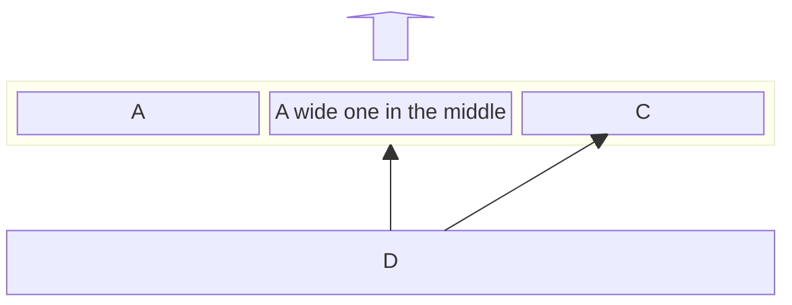

## 项目组织结构

- **`/base`（基础组件层）**：实现了常用的数据结构，并实现了强类型配置反序列框架和异步日志库。
  - [`/utils`](./base/utils/md/README.md)：实现了阻塞队列、线性缓冲区、环形缓冲区、基于阻塞队列的线程池、对象池、可继承的单例类等常用数据结构。
  - `/public`：包含了其它开源库的头文件与源文件。
    - md5加解密：https://github.com/xtaci/algorithms/blob/master/include/md5.h 
    - XML解析：https://github.com/leethomason/tinyxml2 
    - 无锁队列：https://github.com/cameron314/concurrentqueue 
  - [`/config`](./base/config/md/README.md)：实现了强类型XML配置反序列化框架，利用SFINAE与模板特化支持任意类型的序列化/反序列化。
  - [`/log`](./base/log/md/README.md)：实现了基于C++20`std::format`的异步双缓冲日志库，支持多日志级别、自定义日志格式与输出目标。
- [**`/net`（网络层）**](./net/md/README.md)：基于主从Reactor模型，实现了高效的事件驱动型网络框架。框架支持TCP和UDP通信，提供连接管理及消息收发功能，并通过回调机制为上层的提供接口。

- **`/core`（核心基础设施层）**：实现了不依赖具体业务的通用组件。
  - [`/zk`](./core/zk/README.md)：基于ZooKeeper C API，封装了服务注册与发现客户端，支持服务的动态注册、变更监听与本地缓存。
  - [`/redis`](./core/redis/README.md)：基于redis++实现带连接池的单例 Redis 客户端，支持自动心跳、重连与常用Redis操作封装。
  - [`/mysql`](./core/mysql/README.md)：基于 MySQL Connector/C++ X DevAPI 实现带连接池的单例MySQL客户端，支持自动心跳与重连。
  - [`/rpc`](./core/rpc/README.md)：实现了基于异步通信的RPC框架，采用Protobuf自定义消息格式，利用线程池高效处理请求与响应，并集成ZooKeeper实现动态服务管理与负载均衡。
  - [`/frontend`](./core/frontend/README.md)：基于事件驱动架构的高性能接入服务器，支持TCP与UDP双协议通信，采用Protobuf自定义消息格式。集成连接管理、消息编解码与分发、安全认证、异或加密、心跳检测及客户端UDP端口注册等功能，可通过回调机制与上层业务解耦。
- [**`/game`（业务服务层）**](./game/README.md)：实现了具体的后端业务。
  - `/gate`：网关服务器。集成接入服务器和异步RPC框架，实现客户端与后端服务的异步消息转发、双向通信与用户广播。结合Redis实现基于Token的消息过滤与续期，并具备连接管理与断线通知功能。
  - `/account`：账号服务器，集成异步RPC框架，实现注册、登录、Token生成（基于 `stduuid`）与Redis存储防止重复登录。
  - `/center`：中心服务器，集成异步RPC框架，负责大厅房间管理与逻辑服务器负载均衡。
  - `/logic`：逻辑服务器，集成接入服务器与异步RPC框架，采用基于Actor模型的房间架构，实现玩家在场景内的移动、跳跃、进出等状态同步。
  - `/rpc_clients`：统一封装发起跨服务RPC请求的客户端组件。

## 分层架构图

