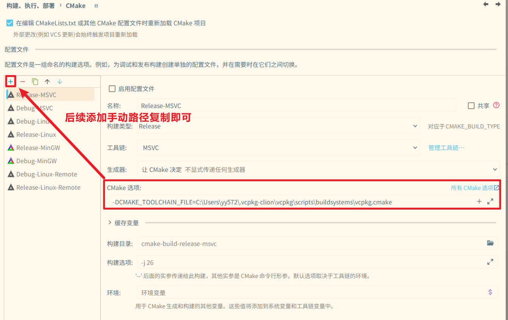

## cmake选项

1. 添加vcpkg路径：类似`-DCMAKE_TOOLCHAIN_FILE=C:\Users\yy572\.vcpkg-clion\vcpkg\scripts\buildsystems\vcpkg.cmake`

   - CLion安装vcpkg时会让你选择是否添加该选项

      

   - 后续添加只需手动复制即可

     

2. Mingw额外选项：vcpkg默认下载的软件包是MSVC的版本，对于mingw应使用该选项进行切换：`-DVCPKG_TARGET_TRIPLET=x64-mingw-static`

   