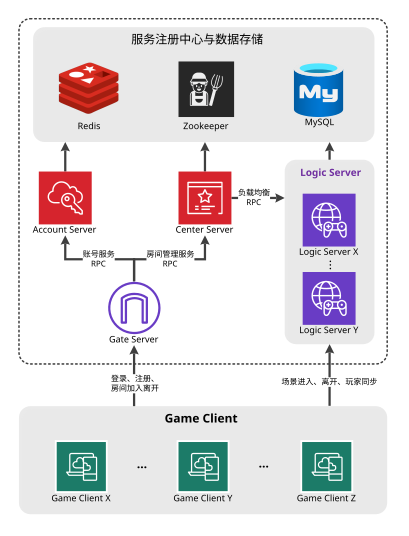
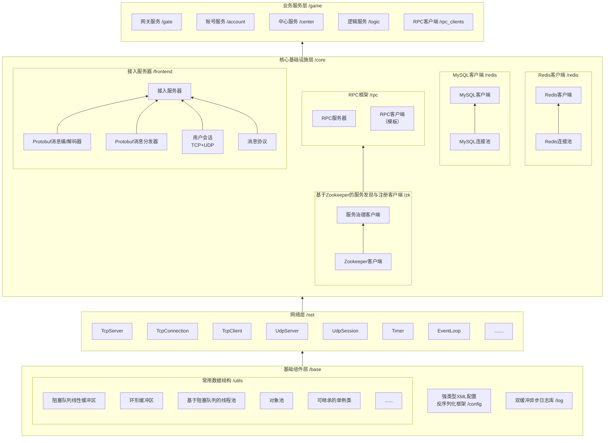

# 面向房间制游戏的分布式服务器框架

## 技术栈

C++20，Socket，TCP/UDP，主从Reactor，ZooKeeper，RPC，Protobuf，MySQL，Redis，CMake，vcpkg，Unity，C#

## 项目简介

围绕房间制游戏业务模型，本项目基于C++20设计并实现了一套分布式后端服务器框架。框架底层实现了跨平台Reactor网络库、异步日志系统、数据库连接池等基础设施。在此基础上构建了异步RPC框架，用于服务间通信，支持动态服务治理、跨服务调用与负载均衡；同时实现了客户端接入服务器，支持TCP/UDP双协议通信，提供会话认证、心跳检测、消息编解码、加解密与业务回调机制。基于上述组件，设计了网关、账号、中心和逻辑服务器的业务架构，为Unity客户端提供登录认证、房间管理和场景内状态同步等核心功能。

## 项目实现

- 跨平台Reactor网络库：采用主从Reactor架构，基于非阻塞I/O与多路复用（epoll/select）支撑高并发连接，使用环形缓冲区高效管理读写数据，并通过std::set+timerfd/select实现定时器，利用eventfd/UDP Socket Pair完成跨线程任务投递与事件唤醒；
- 异步日志系统：采用双缓冲+后台线程异步写入设计，减少业务线程阻塞，并基于C++20的std::format提供灵活日志格式，支持多日志级别和自定义输出目标；
- 数据库连接池：基于Connector/C++ X Dev API和redis++实现MySQL与Redis单例连接池，使用互斥锁和条件变量保证线程安全获取连接，并通过智能指针和自定义删除器实现RAII自动回收，同时结合Reactor定时器实现自动心跳与重连；
- 异步RPC框架：基于Protobuf定义接口与消息格式，引入ZooKeeper进行服务治理；客户端通过服务发现获取服务节点并维护连接池，支持轮转或指定节点调用实现负载均衡，采用异步请求-响应模型提升并发能力，同时通过Watch机制感知节点上下线；服务端注册临时服务节点，实现断连后的自动下线；
- 客户端接入服务器：基于Protobuf定义消息格式并序列化，实现TCP/UDP双通道通信，其中UDP端口与TCP连接绑定形成逻辑会话，UDP数据统一通过单Reactor接收并分发处理；使用MD5+共享密钥进行会话认证，并对消息进行异或加密保证安全，同时提供业务事件回调，实现与上层逻辑的解耦；
- 业务架构：各业务服务器统一集成接入服务器和异步RPC框架。账号服实现注册和登录，账号信息存储于MySQL，使用stduuid生成128位网关Token并存储于Redis，用于网关服验证及防止重复登录；网关服负责客户端与后端的异步消息转发、双向通信及用户广播，并通过Redis提供基于Token的消息验证与会话续期，同时在用户断线时向中心服通告；中心服管理大厅房间与逻辑服负载均衡，并生成128位场景Token供客户端登录逻辑服；逻辑服采用基于Reactor的Actor模型实现房间服务，通过Redis验证玩家Token，并基于UDP协议实现场景内玩家数据的状态同步。

## 分布式架构图

## 项目组织结构

- **`/base`（基础组件层）**：实现了常用的数据结构，并实现了强类型配置反序列框架和异步日志库。
  - [`/utils`](./doc/utils.md)：实现了阻塞队列、线性缓冲区、环形缓冲区、基于阻塞队列的线程池、对象池、可继承的单例类等常用数据结构。
  - `/public`：包含了其它开源库的头文件与源文件。
    - md5加解密：https://github.com/xtaci/algorithms/blob/master/include/md5.h 
    - XML解析：https://github.com/leethomason/tinyxml2 
  - [`/config`](./doc/config.md)：实现了强类型XML配置反序列化框架，利用SFINAE与模板特化支持任意类型的序列化/反序列化。
  - [`/log`](./doc/log.md)：实现了**基于C++20`std::format`的异步双缓冲日志库**，支持多日志级别、自定义日志格式与自定义输出目标。
- [**`/net`（网络层）**](./doc/net.md)：实现了基于**主从Reactor模型**的跨平台网络框架。框架支持TCP/UDP通信，提供连接管理与消息收发功能，并通过回调机制为上层应用提供业务扩展接口。
  - 主从Reactor架构：主Reactor负责接受新连接，从Reactor负责已建立连接的读写事件处理。每个Reactor线程独立运行事件循环（One Loop per Thread），并结合多路复用技术与非阻塞I/O，实现高性能异步网络通信。
  - I/O多路复用：Linux下使用`epoll`，Windows下使用`select`
  - 定时器：由红黑树（`std::set`）管理；Linux下使用`timerfd`进行事件驱动，而Windows下使用`select`超时参数；
  - 跨线程事件唤醒与任务投递：Linux下基于`eventfd`实现，Windows下基于UDP Socket Pair实现；
  - 读写缓冲区：采用**环形缓冲区**进行管理。 
- **`/core`（核心基础设施层）**：实现了不依赖具体业务的通用组件。
  - [`/zk`](./doc/zk.md)：基于ZooKeeper C API，封装了服务治理客户端组件，支持**服务注册、服务发现、服务节点变更监听以及本地缓存机制**。
  - [`/redis`](./doc/redis.md)：基于redis++实现带连接池的单例Redis客户端，采用RAII自动管理连接，支持自动心跳、重连与常用Redis操作封装。
  - [`/mysql`](./doc/mysql.md)：基于MySQL Connector/C++ X DevAPI实现带连接池的单例MySQL客户端，采用RAII自动管理连接，支持自动心跳与重连。
  - [`/rpc`](./doc/rpc.md)：实现了一套**基于异步通信的 RPC 框架**，使用 Protobuf 定义接口与消息格式，通过ZooKeeper完成服务注册、发现与动态治理，并结合**连接池**机制实现**客户端侧负载均衡**。
  - [`/frontend`](./doc/frontend.md)：基于事件驱动架构的高性能接入服务器，支持TCP与UDP双协议通信，采用Protobuf自定义消息格式。集成连接管理、消息编解码与分发、安全认证、异或加密、心跳检测及客户端UDP端口注册等功能，可通过回调机制与上层业务解耦。
- [**`/game`（业务服务层）**](./doc/game.md)：基于核心基础设施层的通用组件，实现了具体的后端业务。
  - `/gate`：网关服务器。集成接入服务器和异步RPC框架，实现客户端与后端服务的异步消息转发、双向通信与用户广播。结合Redis实现基于Token的消息过滤与续期，并具备连接管理与断线通知功能。
  - `/account`：账号服务器，集成异步RPC框架，实现注册、登录、Token生成（基于跨平台UUID库`stduuid`）与Redis存储防止重复登录。
  - `/center`：中心服务器，集成异步RPC框架，负责大厅房间管理与逻辑服务器负载均衡。
  - `/logic`：逻辑服务器，集成接入服务器与异步RPC框架，采用基于Actor模型的房间架构，实现玩家在场景内的移动、跳跃、进出等状态同步。
  - `/rpc_clients`：统一封装发起跨服务RPC请求的客户端组件。

### 分层架构图

