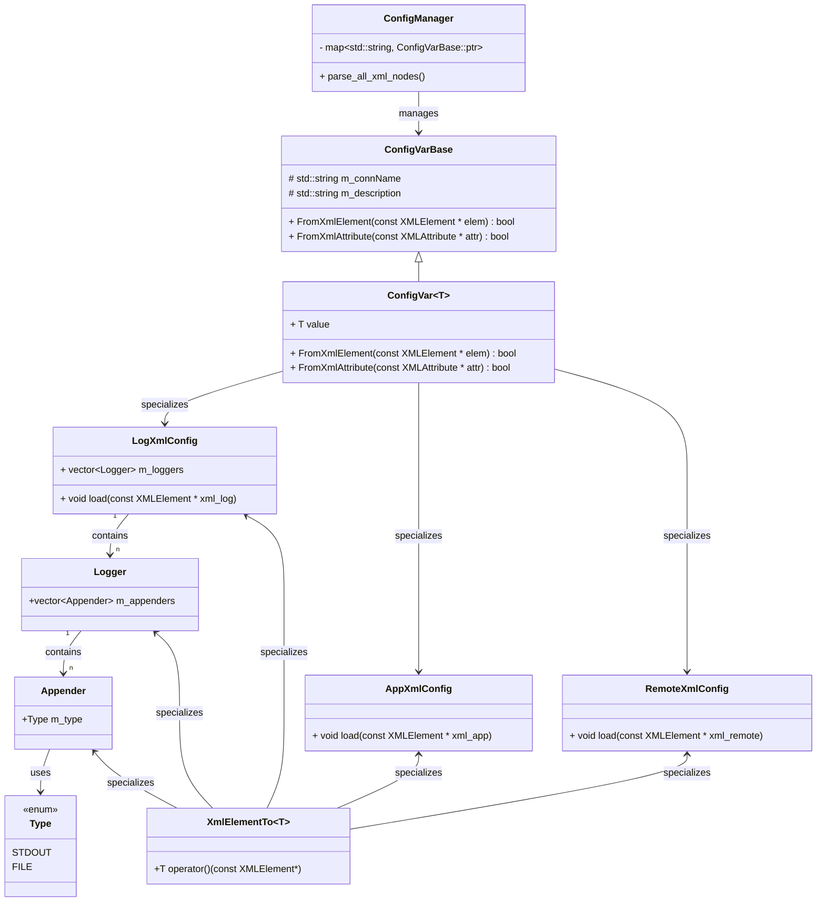
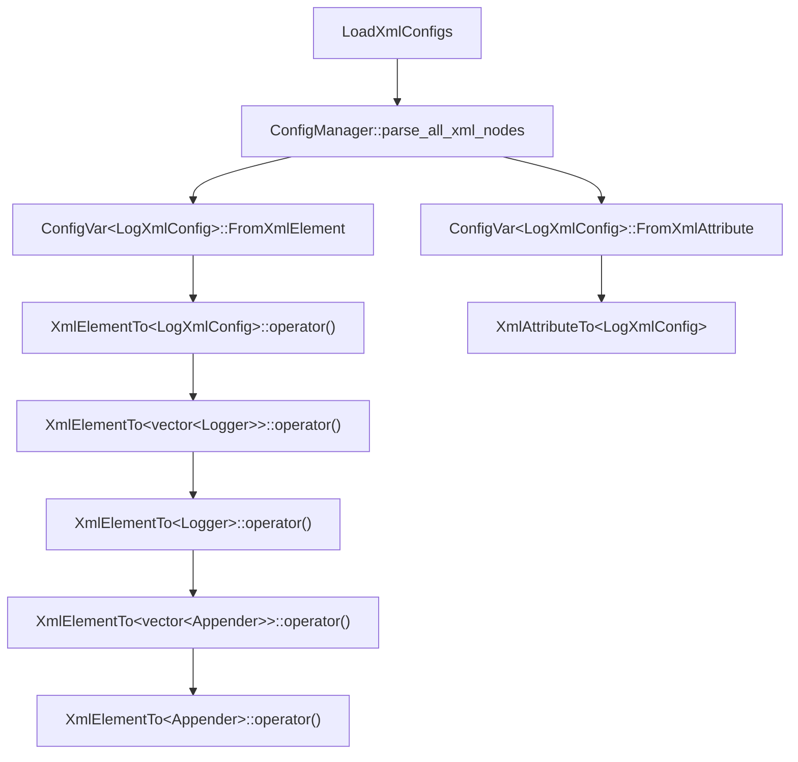

- 类型安全：通过读取XML并自动映射到C++的强类型变量，使得在编译期/运行期（服务器启动时）都能发现类型不匹配问题。
- 可扩展：通过模板特化实现不同配置类型的专属解析逻辑，结合全局注册机制，实现了配置项的灵活扩展与统一管理，确保配置解析与管理职责清晰且可扩展性强。

配置系统特点（优点）

1. 类型安全的配置解析  
   - 使用模板元编程（如 `XmlAttributeTo`、`XmlElementTo``）实现类型驱动的反序列化，支持整数、浮点、布尔、字符串等类型，编译期检查类型合法性，减少运行时错误。`
   - 通过模板特化（如 `XmlElementTo<AppXmlConfig>`）为复杂类型提供定制解析逻辑，灵活性高。
     - **职责分离**：`XmlElementTo<AppXmlConfig>`负责解析，`AppXmlConfig`负责存储（`AppXmlConfig`只读，因此需将前者设置为其友元）

2. 模块化与可扩展性  
   • 每个配置项（如 `AppXmlConfig`、`LogXmlConfig`）独立封装，职责单一，结构清晰。

   • 支持嵌套配置结构（如日志的 `Logger` 包含多个 `Appender`），可处理复杂层级。

3. 线程安全与回调机制  
   • 在 `ConfigVar` 中使用读写锁（`RWLock`）保证多线程安全。

   • 支持注册回调函数（`OnChangeCallback`），配置变更时可触发通知，适合动态热更新。

4. 集中式配置管理  
   • 通过 `ConfigManager` 统一管理所有配置项，支持全局访问（如 `g_app_config`），简化配置项查找与更新。

5. 错误处理与日志  
   • 在类型转换失败时抛出异常（如 `XmlAttributeTo`），避免无效配置传播。

   • 部分代码（如日志配置）提供默认值降级处理，增强鲁棒性。

---

待改进点

1. 内存安全问题  
   • 问题：`memcpy` 复制字符串到固定大小数组（如 `securityCode[20]`）存在缓冲区溢出风险。  

   • 改进：改用 `strncpy` 或 `std::string`，并添加长度校验。

2. 错误处理机制不足  
   • 问题：异常处理分散（如 `XmlAttributeTo` 直接抛出异常），缺乏统一错误日志和恢复机制。  

   • 改进：引入全局错误处理接口，记录详细错误上下文（如 XML 节点路径）。

3. 代码冗余与可维护性  
   • 问题：配置类（如 `AppXmlConfig` 和 `RemoteXmlConfig`）的 `load` 方法存在重复代码。  

   • 改进：通过模板或基类抽象公共逻辑（如属性解析循环）。

4. 扩展性限制  
   • 问题：强依赖 XML 格式，难以支持 JSON/YAML 等其他格式。  

   • 改进：抽象解析接口（如 `IConfigParser`），支持多格式插件化扩展。

5. 文档与注释不足  
   • 问题：部分关键逻辑（如 `ConfigManager` 的加载流程）缺乏详细说明。  

   • 改进：补充设计文档和示例，说明配置项注册、解析流程。

6. 硬编码路径与配置灵活性  
   • 问题：配置文件路径硬编码（如 `kConfigPaths`），不支持动态指定。  

   • 改进：支持环境变量或命令行参数指定配置文件路径。

7. 类型转换的健壮性  
   • 问题：部分类型转换（如 `XmlAttributeTo<bool>`）未处理字符串形式的 "true/false"。  

   • 改进：增强类型兼容性（如支持 "on/off" 或 "1/0" 表示布尔值）。

---

总结

优点：类型安全、模块化设计、线程安全、支持热更新，适合需要高可靠性和复杂配置的服务器应用。  
改进方向：提升安全性（内存/错误处理）、减少冗余、增强扩展性，完善文档与日志，使其更健壮易维护。

