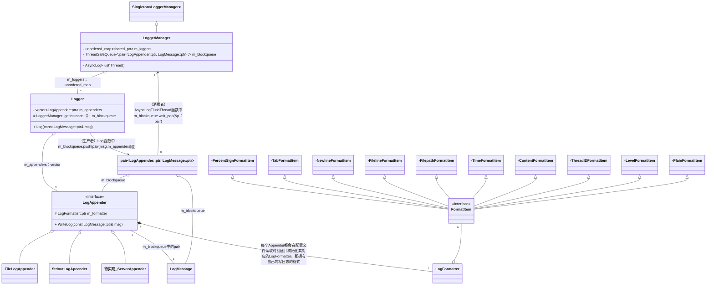

```mermaid
classDiagram
    Singleton~LoggerManager~ <|-- LoggerManager
    class LoggerManager{
    	- unordered_map~shared_ptr~ m_loggers 
    	- ThreadSafeQueue＜pair~LogAppender::ptr, LogMessage::ptr~＞ m_blockqueue
    	- AsyncLogFlushThread()
    }
        
    LoggerManager "1" o-- "n" Logger: m_loggers：unordered_map
    LoggerManager "1" <-- "n" pair~LogAppender::ptr, LogMessage::ptr~: （消费者）AsyncLogFlushThread函数中m_blockqueue.wait_pop(&p：pair)
    pair~LogAppender::ptr, LogMessage::ptr~ o-- LogAppender: m_blockqueue
    pair~LogAppender::ptr, LogMessage::ptr~ o-- LogMessage: m_blockqueue
   
    
    class Logger{
        + Log(const LogMessage::ptr& msg)
        - vector~LogAppender::ptr~ m_appenders
        # LoggerManager::getInstance（）.m_blockqueue
    }
    Logger "1" o-- "n" LogAppender: m_appenders：vector
    Logger --> pair~LogAppender::ptr, LogMessage::ptr~: （生产者）Log函数中m_blockqueue.push(pair{msg,m_appenders[i]})
    
    class LogAppender{
    	<<Interface>>
    	+ WriteLog(const LogMessage::ptr& msg)
    	# LogFormatter::ptr m_formatter
    }
    
    LogAppender <|-- FileLogAppender
    LogAppender <|-- StdoutLogApeender
    LogAppender <|-- 待实现_ServerAppender
    
    LogAppender "1" -- "1" LogMessage: m_blockqueue中的pair
    
    FormatItem "n" --o "1" LogFormatter
    
    class FormatItem{
        <<Interface>>
    }
    
    LogAppender "1" *-- "1" LogFormatter : 每个Appender都会在配置文件读取时创建并初始化其对应的LogFormatter，即拥有自己的写日志的格式

    -PlainFormatItem  <|-- FormatItem 
    -LevelFormatItem <|-- FormatItem
    -ThreadIDFormatItem <|-- FormatItem
    -ContentFormatItem <|-- FormatItem
    -TimeFormatItem <|-- FormatItem
    -FilepathFormatItem <|-- FormatItem
    -FilelineFormatItem <|-- FormatItem
    -NewlineFormatItem <|-- FormatItem
    -TabFormatItem <|-- FormatItem
    -PercentSignFormatItem <|-- FormatItem


```

