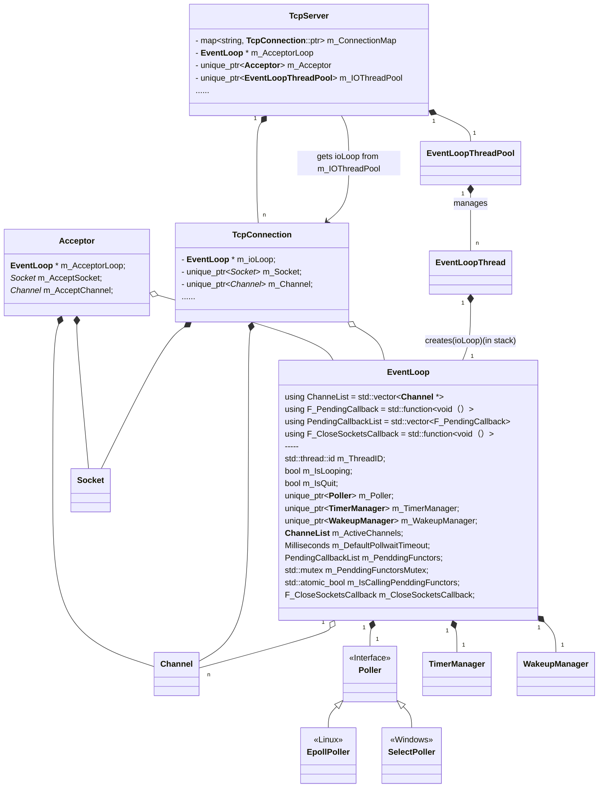

```mermaid
classDiagram
    direction TB
    
    class TcpServer {
        - map~string, **TcpConnection**::ptr~ m_ConnectionMap
        - **EventLoop** * m_AcceptorLoop
        - unique_ptr~**Acceptor**~ m_Acceptor
        - unique_ptr~**EventLoopThreadPool**~ m_IOThreadPool
        
        ......
    }
    
    class TcpConnection {
        - **EventLoop** *                  m_ioLoop;  
        - unique_ptr~*Socket*~             m_Socket;
        - unique_ptr~*Channel*~            m_Channel;   
        ......
    }
    

    
	class EventLoop {
	    using ChanneList = std::vector~**Channel** *~
        using F_PendingCallback = std::function~void（）~
        using PendingCallbackList = std::vector~F_PendingCallback~
        using F_CloseSocketsCallback = std::function~void（）~
        
        -----
	
        std::thread::id                m_ThreadID;
        bool                           m_IsLooping;
        bool                           m_IsQuit;
        unique_ptr~**Poller**~         m_Poller;         
        unique_ptr~**TimerManager**~   m_TimerManager;
        unique_ptr~**WakeupManager**~  m_WakeupManager;   
        **ChanneList**                 m_ActiveChannels;
        Milliseconds                   m_DefaultPollwaitTimeout;
        PendingCallbackList            m_PenddingFunctors;      
        std::mutex                     m_PenddingFunctorsMutex; 
        std::atomic_bool               m_IsCallingPenddingFunctors;

        F_CloseSocketsCallback m_CloseSocketsCallback;
	}
	
	class Channel {
	
	}
	
	class Socket {
	
	}
	
    class Acceptor {
        **EventLoop** *           m_AcceptorLoop;
        *Socket*                  m_AcceptSocket;
        *Channel*                 m_AcceptChannel;
    }
	
	class Poller{
		<<Interface>>
	}
	
	class EpollPoller {
		<<Linux>>
	}
	
    class SelectPoller {
		<<Windows>>
	}
	
	class TimerManager{
	
	}
	
	class WakeupManager{
	
	}
	
    Acceptor *-- Socket
    Acceptor o-- EventLoop
    Acceptor *-- Channel
	
    TcpConnection *-- Socket
    TcpConnection o-- EventLoop
    TcpConnection *-- Channel
    EventLoop "1" o-- "n" Channel
    EventLoop "1" *-- "1" Poller
    Poller <|-- EpollPoller
    Poller <|-- SelectPoller
    EventLoop "1" *-- "1" TimerManager
    EventLoop "1" *-- "1" WakeupManager
    TcpConnection <-- TcpServer: gets ioLoop from m_IOThreadPool
    TcpServer "1" *-- "n" TcpConnection
    TcpServer "1" *-- "1" EventLoopThreadPool
    

    EventLoopThreadPool "1" *-- "n" EventLoopThread : manages 
    EventLoopThread "1" *-- "1" EventLoop: creates(ioLoop)(in stack)
```

