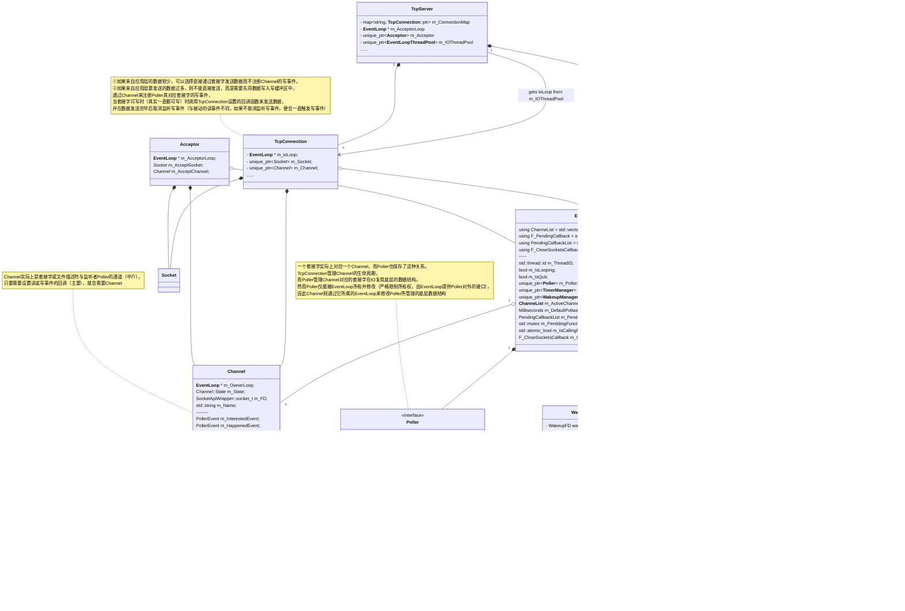
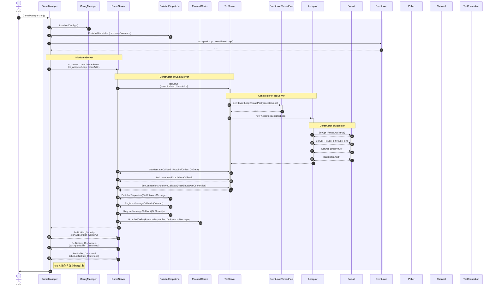
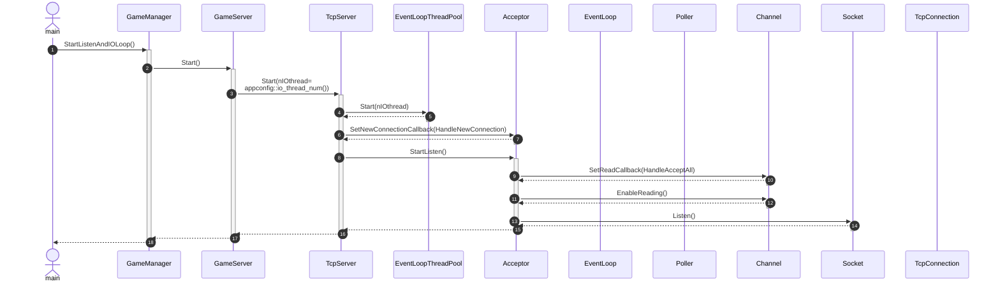
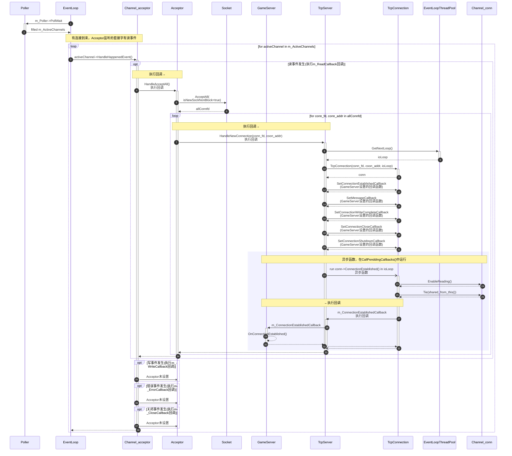
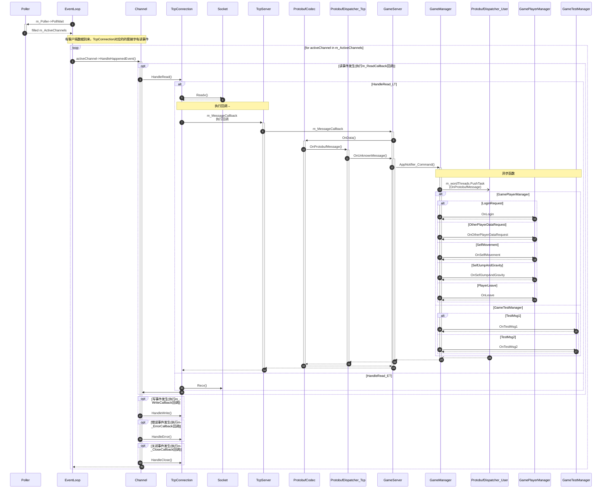
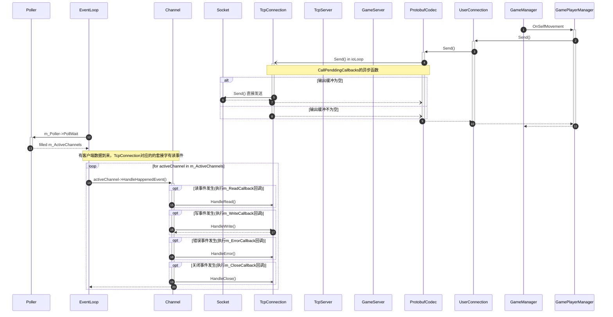
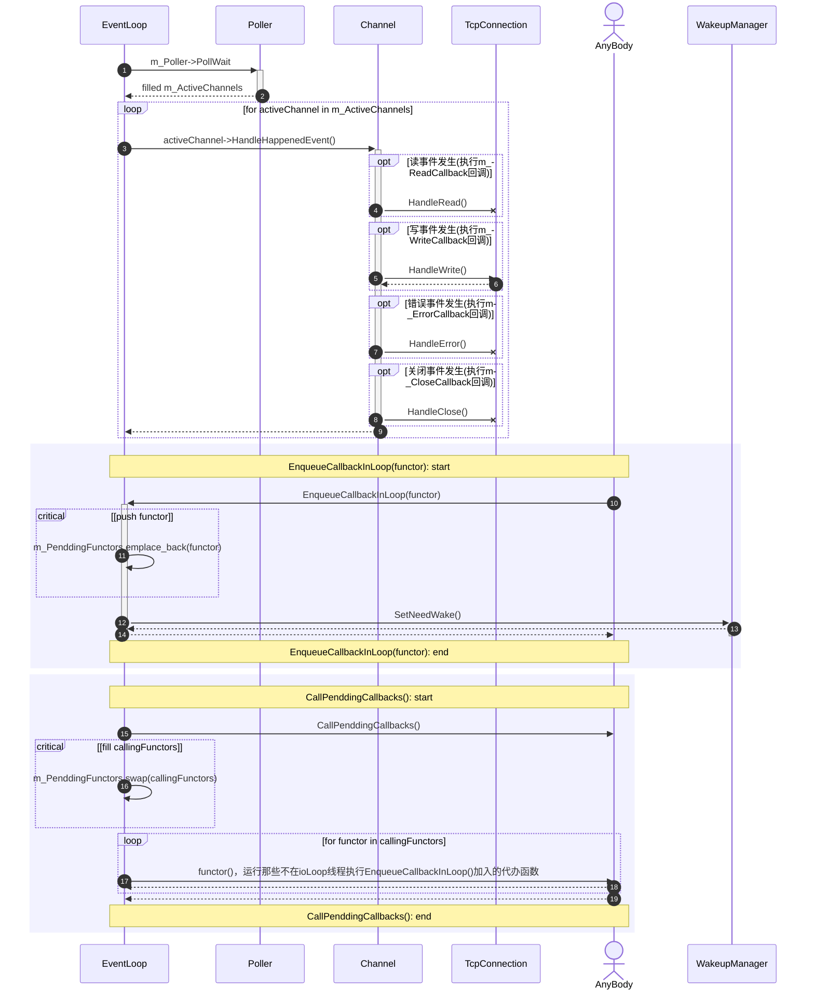

#### 主线程（即Acceptor线程）初始化（`GameManager::Init()`）：EventLoop的构造较复杂，不在此列出

### 主线程（即Acceptor线程）启动（`GameManager::StartListenAndIOLoop()`）：

### 接受用户连接的过程（`Acceptor::HandleAcceptAll`的channel读回调与`TcpServer::HandleNewConnection`回调）

## 读事件：接受客户端数据的调用流程图

## 写事件：

## 代办函数的执行逻辑:

