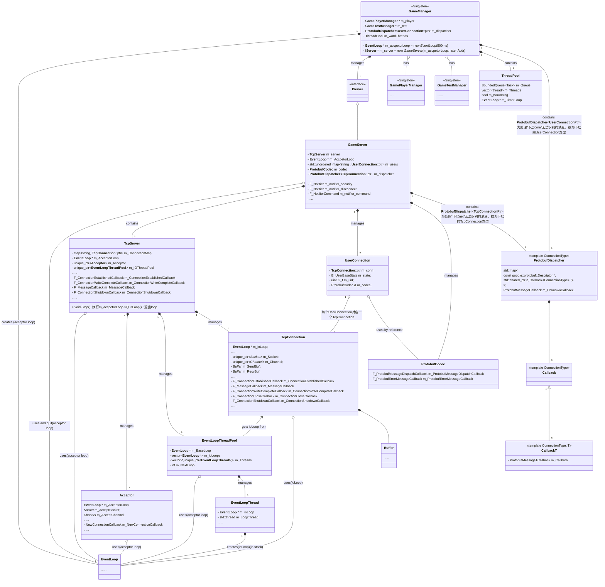
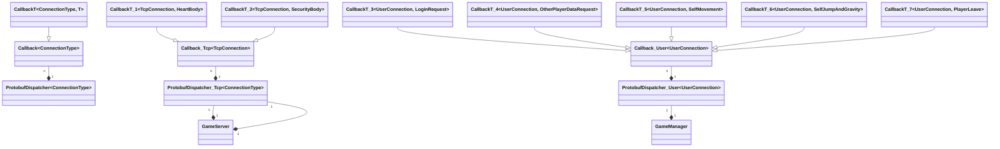

- contains：类内的普通成员
- creates/manages：类内的指针成员，由管理者new并delete

```mermaid
classDiagram
    direction TB
    
	
    class GameManager {
    	<<Singleton>>
        - **EventLoop** * m_accpetorLoop = new *EventLoop*(500ms)
        - **IServer**   * m_server = new *GameServer*(m_accpetorLoop, listenAddr)
        
        - **GamePlayerManager** * m_player
        - **GameTestManager**   * m_test
        - **ProtobufDispatcher**<**UserConnection**::ptr> m_dispatcher
        - **ThreadPool** m_wordThreads
    }
    
    class GamePlayerManager{
    	<<Singleton>>
    	......
    }
    class GameTestManager{
		<<Singleton>>
		......
    }
    
    class ProtobufDispatcher {
        <<template ConnectionType>>

        std::map<
        	const google::protobuf::Descriptor *,
        	std::shared_ptr＜ Callback~ConnectionType~ ＞
        >;
        
        ProtobufMessageCallback m_UnknownCallback;
    }

    
    class ThreadPool {
        BoundedQueue~Task~            m_Queue
        vector~thread~                m_Threads
        bool                          m_IsRunning
        **EventLoop** *               m_TimerLoop
    }

    
    class IServer {
        <<interface>>
    }
	
	class GameServer {
        - **TcpServer** m_server
        - **EventLoop** * m_AccpetorLoop
        - std::unordered_map~string , **UserConnection**::ptr~ m_users
        - **ProtobufCodec**               m_codec
        - **ProtobufDispatcher**<**TcpConnection**::ptr~ m_dispatcher
        
        ......
        
        - F_Notifier        m_notifier_security
        - F_Notifier        m_notifier_disconnect
        - F_NotifierCommand m_notifier_command
        
        ......
	}
	
	class ProtobufCodec {
	    - F_ProtobufMessageDispatchCallback   m_ProtobufMessageDispatchCallback
        - F_ProtobufErrorMessageCallback      m_ProtobufErrorMessageCallback
	}
	    
    class UserConnection {
        - **TcpConnection**::ptr m_conn
        
        - E_UserBaseState       m_state;
        - uint32_t              m_uid;
        - ProtobufCodec &       m_codec;
    }

    class TcpServer {
        - map~string, **TcpConnection**::ptr~ m_ConnectionMap
        - **EventLoop** * m_AcceptorLoop
        - unique_ptr~**Acceptor**~ m_Acceptor
        - unique_ptr~**EventLoopThreadPool**~ m_IOThreadPool
        
        ......
        
        - F_ConnectionEstablishedCallback      m_ConnectionEstablishedCallback
        - F_ConnectionWriteCompleteCallback    m_ConnectionWriteCompleteCallback
        - F_MessageCallback                    m_MessageCallback
        - F_ConnectionShutdownCallback         m_ConnectionShutdownCallback
        
        ......
        
        + void Stop(): 执行m_accpetorLoop->QuitLoop()退出loop
    }
    
    class Acceptor {
        **EventLoop** *           m_AcceptorLoop;
        *Socket*                  m_AcceptSocket;
        *Channel*                 m_AcceptChannel;
        
        ......
        
        - NewConnectionCallback   m_NewConnectionCallback
        
        ......
    }

    class TcpConnection {
        - **EventLoop** *                 m_ioLoop;
        
        ......
        
        - unique_ptr~*Socket*~             m_Socket;
        - unique_ptr~*Channel*~            m_Channel;
        - *Buffer* m_SendBuf;
        - *Buffer* m_RecvBuf;
        
        ......
        
        - F_ConnectionEstablishedCallback      m_ConnectionEstablishedCallback  
        - F_MessageCallback                    m_MessageCallback
        - F_ConnectionWriteCompleteCallback    m_ConnectionWriteCompleteCallback
        - F_ConnectionCloseCallback            m_ConnectionCloseCallback
        - F_ConnectionShutdownCallback         m_ConnectionShutdownCallback
        
        ......
    }
    
    class Buffer {
    	......
    }
    
    class EventLoopThreadPool {
        - **EventLoop** *                          m_BaseLoop
        - vector~**EventLoop** *~                  m_ioLoops
        - vector＜unique_ptr~**EventLoopThread**~＞ m_Threads
        - int                                      m_NextLoop
    }
    
	class EventLoopThread {
		- **EventLoop** * m_ioLoop
		- std::thread m_LoopThread
		......
	}
	
	class EventLoop {
		......
	}
	
	subgraph LAYER_GAME
        GameManager "1" *-- "1" EventLoop : creates (acceptor loop)
        GameManager "1" *-- "1" IServer : manages 
        GameManager o-- GamePlayerManager: has
        GameManager o-- GameTestManager: has
        GameManager "1" *-- "1" ThreadPool: contains 
        
	end
	
	subgraph LAYER_CORE
        IServer <|-- GameServer
        GameServer o-- EventLoop : uses and quit(acceptor loop)
        GameServer "1" *-- "1" TcpServer : contains 
        
        GameServer "1" *-- "n" UserConnection  : manages
        GameServer "1" *-- "1" ProtobufCodec : manages        
        UserConnection "1" o-- "1" TcpConnection :  每个UserConnection对应一个TcpConnection
        UserConnection  o-- ProtobufCodec : uses by reference
    end
    
    subgraph LAYER_NET
        TcpServer o-- EventLoop : uses(acceptor loop)
        Acceptor o-- EventLoop : uses(acceptor loop)
        TcpServer "1" *-- "1" Acceptor : manages
        TcpServer "1" *-- "1" EventLoopThreadPool : manages
        TcpServer "1" *-- "n" TcpConnection : manages
        TcpConnection <-- EventLoopThreadPool: gets ioLoop from
        TcpConnection o-- EventLoop: uses(ioLoop)
        TcpConnection *-- Buffer

        EventLoopThreadPool o-- EventLoop: uses(acceptor loop)
        EventLoopThreadPool "1" *-- "n" EventLoopThread : manages 
        EventLoopThread "1" *-- "1" EventLoop: creates(ioLoop)(in stack)
    end
    class CallbackT {
    	<<template ConnectionType, T>>
    	- ProtobufMessageTCallback m_Callback
    }
    
    class Callback {
    	<<template ConnectionType>>
    }

    Callback "1" <|-- "n" CallbackT
    
    ProtobufDispatcher "1" *-- "n" Callback
    
    GameServer "1" *-- "1" ProtobufDispatcher : contains **ProtobufDispatcher**<**TcpConnection**Ptr> 为处理“下层net”无法识别的消息，故为下层的TcpConnection类型
    GameManager "1" *-- "1" ProtobufDispatcher : contains **ProtobufDispatcher**<**UserConnection**Ptr> 为处理“下层core”无法识别的消息，故为下层的UserConnection类型
   
    
  
```

`ProtobufDispatcher`图：

```mermaid
classDiagram
    direction TB

    CallbackT~ConnectionType, T~ --|> Callback~ConnectionType~
    Callback~ConnectionType~ "n" --* "1"  ProtobufDispatcher~ConnectionType~
    ProtobufDispatcher_Tcp~ConnectionType~ "1" --* "1" GameServer
    
    CallbackT_1~TcpConnection, HeartBody~    --|> Callback_Tcp~TcpConnection~
    CallbackT_2~TcpConnection, SecurityBody~ --|> Callback_Tcp~TcpConnection~
    Callback_Tcp~TcpConnection~ "n" --* "1"  ProtobufDispatcher_Tcp~TcpConnection~
    ProtobufDispatcher_Tcp~TcpConnection~ "1" --* "1" GameServer
    
    CallbackT_3~UserConnection, LoginRequest~    --|> Callback_User~UserConnection~
    CallbackT_4~UserConnection, OtherPlayerDataRequest~ --|> Callback_User~UserConnection~
    CallbackT_5~UserConnection, SelfMovement~    --|> Callback_User~UserConnection~
    CallbackT_6~UserConnection, SelfJumpAndGravity~ --|> Callback_User~UserConnection~
    CallbackT_7~UserConnection, PlayerLeave~ --|> Callback_User~UserConnection~
    Callback_User~UserConnection~ "n" --* "1"  ProtobufDispatcher_User~UserConnection~
    ProtobufDispatcher_User~UserConnection~ "1" --* "1" GameManager
```

