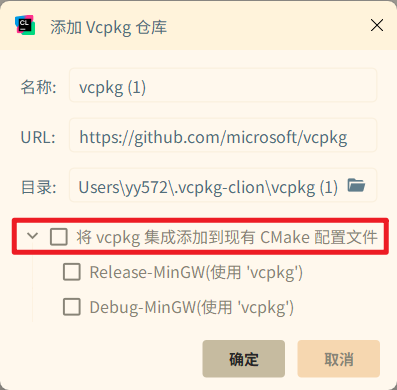
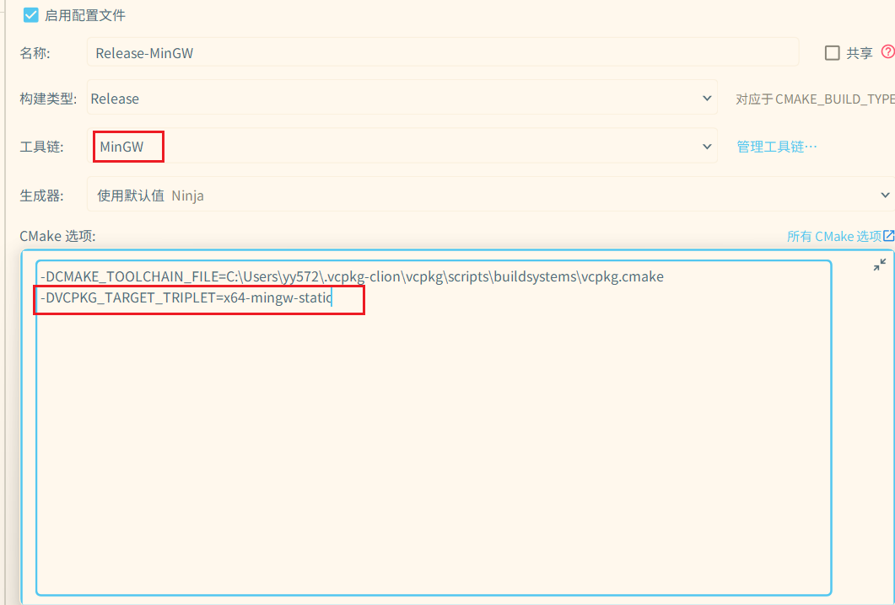

## cmake选项

1. 添加vcpkg路径：类似`-DCMAKE_TOOLCHAIN_FILE=C:\Users\yy572\.vcpkg-clion\vcpkg\scripts\buildsystems\vcpkg.cmake`

   - CLion安装vcpkg时会让你选择是否添加该选项

      

   - 后续添加只需手动复制即可

     

2. Mingw额外选项：vcpkg默认下载的软件包是MSVC的版本，对于mingw应使用该选项进行切换：`-DVCPKG_TARGET_TRIPLET=x64-mingw-static`

   

## 无需`EPOLLONESHOT`

> - 含义：`EPOLLONESHOT` 是 `epoll` 的一个事件选项，表示**某个文件描述符上的事件只会触发一次**。事件被触发后，`epoll` 会自动将其从监听队列中禁用，**必须手动通过 `epoll_ctl(..., EPOLL_CTL_MOD, ...)` 重新激活**，才能再次监听该 fd 的事件。
>
> - 作用：**对于`one-loop multi-thread`模型，防止多个线程同时处理同一个socket所带来的数据竞争**。

本框架采用的是 **“one-loop per-thread”** 模型，每个TCP连接的套接字只在所属的 `EventLoop`（即一个IO线程）中处理事件，即一个连接只会被一个IO线程处理，处理完之后传递给上层的工作线程 ———— 然后继续处理该连接的IO事件....。**天然避免了多个线程同时操作同一个连接的问题**。