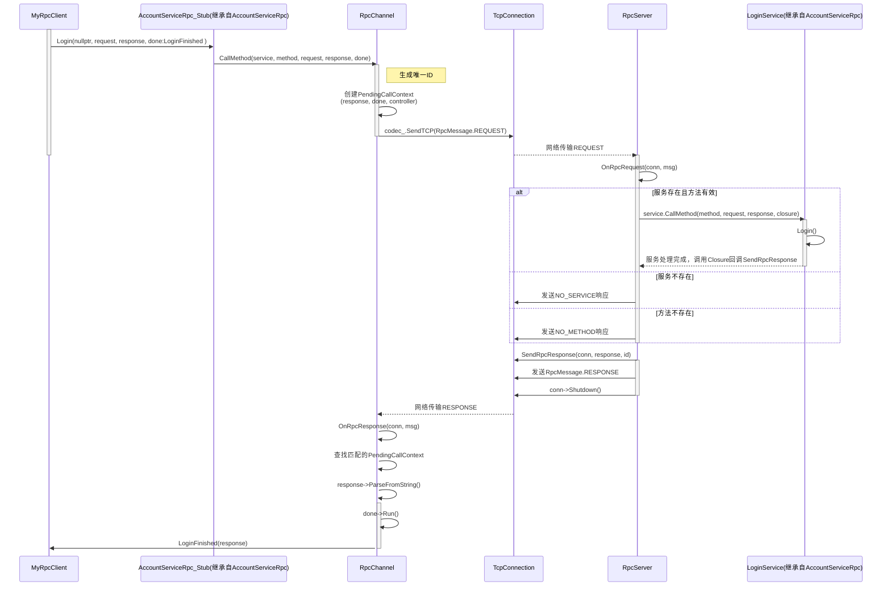
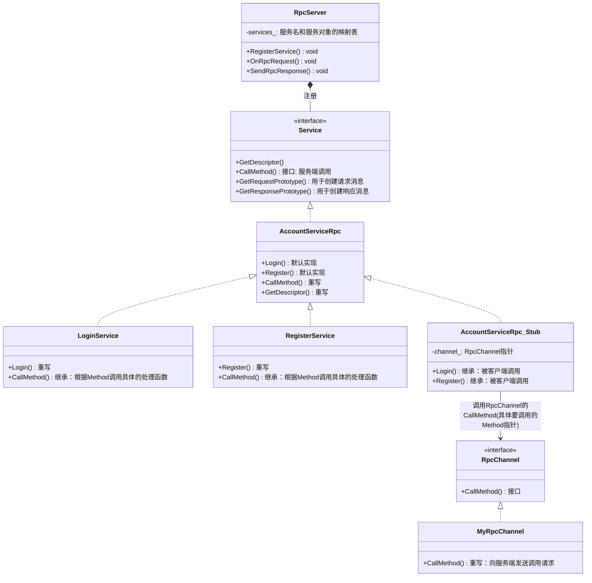

```protobuf
syntax = "proto3";
package yy.protocol.app;

// 重要，开启该选项才会生成service代码
option cc_generic_services = true;

message C2SLogin {
    uint64 session_id = 1;

    string account_name = 3;
    string password = 4;
}

message S2CLogin {
    uint64 session_id = 1;

    enum Status {
        eSuccess = 0;
        eAccountNoExist = 1;
        ePasswordError = 2;
        eUnknownError = 3;
    }
    Status result_code = 2;
    optional uint64 logic_server_id = 3;
    optional uint64 account_id = 4;
    optional string account_name = 5;
}


service AccountServiceRpc
{
    rpc Login(C2SLogin) returns(S2CLogin);
}
```







