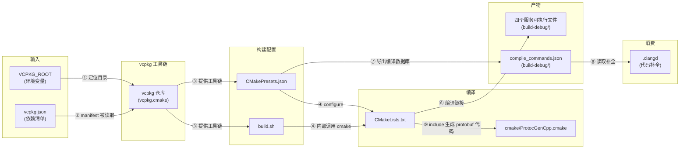
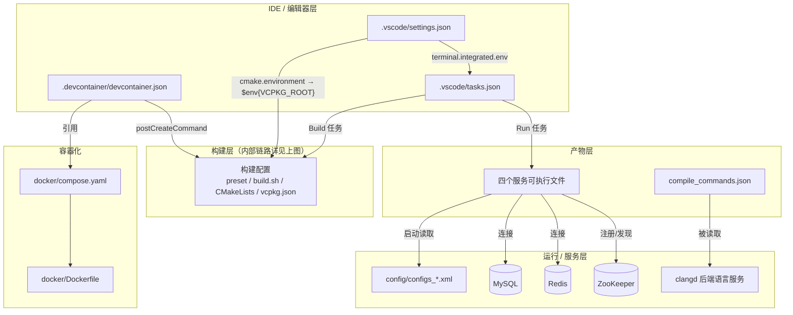

# 项目配置文件详解

> 本文档逐一讲解项目根目录与 `.vscode/` 下各类配置文件的**含义与用法**，
> 覆盖开发、构建、静态检查、容器化等环节。构建与运行的整体流程见
> [`linux-native-build.md`](./linux-native-build.md)。

## 零、配置文件总览

| 文件 | 类型 | 作用 |
|------|------|------|
| `.vscode/settings.json` | VS Code 工作区设置 | CMake Tools / 终端环境变量 |
| `.vscode/tasks.json` | VS Code 任务 | 一键构建 / 运行四服务 |
| `CMakePresets.json` | CMake 预设 | 统一的 configure / build 配置 |
| `CMakeLists.txt` | CMake 顶层脚本 | 依赖查找、宏定义、目标定义 |
| `cmake/ProtocGenCpp.cmake` | CMake 函数 | 用 protoc 生成 C++ 代码 |
| `vcpkg.json` | vcpkg manifest | 三方依赖清单 |
| `build.sh` | Shell 脚本 | 命令行一键构建 |
| `.clangd` | clangd 配置 | 指定编译数据库位置 |
| `.clang-tidy` | clang-tidy 配置 | 静态检查规则集 |
| `.gitignore` | Git 忽略规则 | 排除构建产物等 |
| `.dockerignore` | Docker 忽略规则 | 排除构建上下文 |
| `.devcontainer/devcontainer.json` | Dev Container | 容器化开发环境 |
| `config/configs_*.xml` | 运行时配置 | 各服务的端口 / 依赖 / 日志 |

### 配置文件依赖关系图

**图 1：构建期数据流** —— 编号标注在数据流的边上，从输入到产物与补全



> 说明：`CMakePresets.json` 与 `build.sh` 是**两条等价路径**——前者是 CMake 原生
> 声明式配置，后者是封装了同样 cmake 命令的脚本；二者都依赖 vcpkg 工具链并驱动
> `CMakeLists.txt`，实际构建时二选一即可。

**数据流 ↔ 命令对照表**（编号与图中边上的编号一一对应）：

| 编号 | 依赖关系 | 实际命令 / 配置 |
|------|---------|----------------|
| ① | 环境变量定位 vcpkg 目录 | `export VCPKG_ROOT=$HOME/projects/vcpkg` |
| ② | `vcpkg.json` 被工具链读取 | CMake 配置时自动执行（等价手动 `vcpkg install`） |
| ③ | 提供 vcpkg 工具链 | `-DCMAKE_TOOLCHAIN_FILE=$VCPKG_ROOT/scripts/buildsystems/vcpkg.cmake` |
| ④ | preset / 脚本驱动 CMakeLists | `cmake --preset linux-debug` 或 `./build.sh`（二选一） |
| ⑤ | 生成 protobuf 代码 | 构建时自动执行 `protoc --cpp_out=protobuf protobuf/*.proto` |
| ⑥ | 编译链接 | `cmake --build --preset debug`（或 `cmake --build build-debug -- -j$(nproc)`） |
| ⑦ | 导出编译数据库 | `CMAKE_EXPORT_COMPILE_COMMANDS: ON`（preset 已设置） |
| ⑧ | clangd 读取补全 | `clangd`（VS Code 扩展自动启动，读取 `build-debug/compile_commands.json`） |

**图 2：整体依赖关系全景** —— IDE / 构建 / 运行 / 容器化的横切关系（构建内部链路见上图）



> 图 2 中 MySQL / Redis / ZooKeeper / clangd 并非配置文件，但它们在
> `config/configs_*.xml`（运行时依赖）与 `.clangd`（开发期消费编译数据库）中
> 被声明或使用，故一并画出以体现完整依赖链。

---

## 一、VS Code 配置（`.vscode/`）

### 1.1 `settings.json`

```jsonc
{
    "cmake.useCMakePresets": "always",
    "cmake.configureOnOpen": true,
    "cmake.environment": {
        "VCPKG_ROOT": "/home/yangyue/projects/vcpkg"
    },
    "terminal.integrated.env.linux": {
        "VCPKG_ROOT": "/home/yangyue/projects/vcpkg"
    }
}
```

| 字段 | 含义 |
|------|------|
| `cmake.useCMakePresets` | `always` 表示 **强制使用 `CMakePresets.json`** 来配置，忽略 CMake Tools 面板里的其它手动设置 |
| `cmake.configureOnOpen` | 打开项目时自动执行 CMake configure |
| `cmake.environment` | 注入到 **VS Code 扩展进程**的环境变量（参与 CMakePresets 里 `$env{VCPKG_ROOT}` 的宏展开） |
| `terminal.integrated.env.linux` | 注入到**集成终端**（含 tasks.json 的 shell 任务）的环境变量 |

> **关键坑**（务必理解）：
> - `CMakePresets.json` 中 `"$env{VCPKG_ROOT}"` 是 **宏展开**，发生在扩展进程内，
>   必须用 `cmake.environment` 注入才能展开成功。
> - `cmake.configureEnvironment` 只在调用 `cmake` 子进程时才注入环境，**不参与宏展开**，
>   所以这里不能用它。
> - `$penv{}` 在 `cacheVariables` 中解析不到 preset 的 `environment` 字段值（会解析为空），勿用。

### 1.2 `tasks.json`

定义了两个构建任务 + 四个运行任务 + 两个组合任务，可直接在
**终端 → 运行任务** 或 **Cmd/Ctrl+Shift+B** 中使用。

| 字段 | 含义 |
|------|------|
| `label` | 任务名称（组合任务靠它引用） |
| `type: "shell"` | 以 shell 方式执行命令 |
| `command` | 要执行的命令 |
| `options.cwd` | 任务工作目录（`${workspaceFolder}` 为项目根） |
| `group.kind: "build"` | 归入“构建”组；`isDefault: true` 表示 Ctrl+Shift+B 默认执行 |
| `problemMatcher: ["$gcc"]` | 用 GCC 错误格式解析输出，错误能跳转到代码位置 |
| `isBackground: true` | 后台任务（服务长期运行，不阻塞） |
| `presentation` | 输出面板行为：`panel: dedicated` 独立面板、`group: servers` 分组、`reveal: always` 自动显示、`clear: true` 每次清屏 |
| `dependsOn` | 组合任务的依赖子任务列表 |
| `dependsOrder` | `parallel` 并行 / `sequence` 顺序执行 |

任务清单：

| 任务 | 说明 |
|------|------|
| `Build Debug` / `Build Release` | 调用 `./build.sh debug` / `release` |
| `Run CenterServer` 等 4 个 | 后台运行各服务（Debug 版本） |
| `Run All Servers` | 并行启动四个服务 |
| `Build & Run All` | 先构建，再运行全部服务 |

---

## 二、CMake 构建配置

### 2.1 `CMakePresets.json`

CMake 3.19+ 引入的预设文件，把“如何 configure / build”写成声明式配置，
IDE 和命令行共用同一份。

```jsonc
{
  "version": 3,
  "cmakeMinimumRequired": { "major": 3, "minor": 22, "patch": 0 },
  "configurePresets": [
    {
      "name": "linux-debug",
      "generator": "Ninja",
      "binaryDir": "${sourceDir}/build-debug",
      "cacheVariables": {
        "CMAKE_BUILD_TYPE": "Debug",
        "CMAKE_EXPORT_COMPILE_COMMANDS": "ON",
        "CMAKE_TOOLCHAIN_FILE": "$env{VCPKG_ROOT}/scripts/buildsystems/vcpkg.cmake"
      }
    }
    // ... linux-release 类似
  ],
  "buildPresets": [
    { "name": "debug", "configurePreset": "linux-debug" }
    // ... release
  ]
}
```

| 字段 | 含义 |
|------|------|
| `version` | preset 文件格式版本（当前为 3） |
| `cmakeMinimumRequired` | 要求的最低 CMake 版本 |
| `configurePresets[].name` | 预设名，命令行 `cmake --preset <name>` 引用 |
| `generator: "Ninja"` | 使用 Ninja 构建后端（比 Make 快） |
| `binaryDir` | 构建输出目录，`${sourceDir}` 为项目根 |
| `cacheVariables` | 等价于 `-D` 传入的缓存变量 |
| `CMAKE_BUILD_TYPE` | `Debug` / `Release` 构建类型 |
| `CMAKE_EXPORT_COMPILE_COMMANDS` | `ON` 生成 `compile_commands.json`（供 clangd 使用） |
| `CMAKE_TOOLCHAIN_FILE` | 指定 vcpkg 工具链，用 `$env{VCPKG_ROOT}` 宏展开 |
| `buildPresets[].configurePreset` | build 预设关联哪个 configure 预设 |

用法：

```bash
export VCPKG_ROOT=$HOME/projects/vcpkg
cmake --preset linux-debug      # 配置
cmake --build --preset debug    # 构建
```

> 本项目其实不直接用 preset 构建，而是通过 `build.sh` 封装（见第四节）。

### 2.2 顶层 `CMakeLists.txt`

核心内容按顺序解读：

| 片段 | 作用 |
|------|------|
| `cmake_minimum_required(VERSION 3.22)` | 最低 CMake 版本 |
| `project(GameServer)` | 项目名 |
| `find_package(GTest/stduuid/redis++/... )` | 查找 vcpkg 安装的依赖 |
| `set(CMAKE_CXX_STANDARD 20)` | 使用 C++20 |
| 平台判断（`____WINDOWS`/`____LINUX`/`____MACOS`） | 跨平台宏定义 |
| 编译器判断（`____MSVC`/`____GNUC`） | 编译器相关选项、编码设置 |
| `add_definitions(-D____DEBUG)` | Debug 构建宏 |
| `find_package(Protobuf ...)` | 查找 protobuf |
| `include(cmake/ProtocGenCpp.cmake)` | 引入 protoc 生成函数 |
| `add_subdirectory(base/net/core/...)` | 递归构建各模块 |
| `add_library(CommonLibrary STATIC ...)` | 汇总成静态库 `libCommonLibrary.a` |
| `add_executable(LogicServer ...)` 等 4 个 | 定义四个服务可执行文件 |

关键链接库（`target_link_libraries(CommonLibrary ...)`）：

| 库 | 来源 | 说明 |
|----|------|------|
| `protobuf::libprotobuf` 等 | vcpkg | Protobuf |
| `zookeeper_mt` | **系统库** | ZooKeeper C 客户端（不走 vcpkg） |
| `redis++::redis++_static` | vcpkg | Redis 客户端 |
| `unofficial::mysql-connector-cpp::connector` | vcpkg | MySQL 客户端（X DevAPI） |
| `stduuid` | vcpkg | UUID 生成 |
| `pthread` / `resolv` | 系统 | 线程 / DNS 解析 |

> 注意：`unofficial-zookeeper` 的 `find_package` 与 `unofficial::zookeeper::zookeeper`
> 链接均被注释，因为 vcpkg 的 zookeeper 下载地址 404 且库名不匹配，统一用系统库。

### 2.3 `cmake/ProtocGenCpp.cmake`

定义 CMake 函数 `ProtoGenCpp(ProtocDirname)`：对指定目录下所有 `.proto`
文件调用 `protoc` 生成 `.pb.cc` / `.pb.h`。

关键点：

- `--cpp_out=${ProtocDirname}`：C++ 代码与 `.proto` 同目录生成；
- `--experimental_allow_proto3_optional`：允许 proto3 的 `optional` 关键字；
- `file(GLOB ...)`：收集目录下所有 `.proto`；
- 顶层 `CMakeLists.txt` 中调用 `ProtoGenCpp(${CMAKE_SOURCE_DIR}/protobuf)`，
  即对 `protobuf/` 目录生成代码。

---

## 三、vcpkg 依赖清单（`vcpkg.json`）

这是 vcpkg 的 **manifest 模式**清单文件，声明项目依赖，无需手动 `vcpkg install`。

```jsonc
{
  "name": "gameserver",
  "version-string": "1.0.0",
  "builtin-baseline": "cd5e746ec203c8c3c61647e0886a8df8c1e78e41",
  "dependencies": [ ... ]
}
```

| 字段 | 含义 |
|------|------|
| `name` / `version-string` | 项目名与版本 |
| `builtin-baseline` | **固定的 vcpkg 基线 commit**，锁定所有依赖的版本，保证可复现构建。这就是为什么 vcpkg 目录必须保留 `.git` |
| `dependencies` | 依赖列表，可带 `version>=` 约束与 `features` |

依赖说明：

| 依赖 | 用途 |
|------|------|
| `protobuf >= 3.21.12` | 消息序列化 / RPC 接口定义 |
| `lua >= 5.4.7`（features: tools, cpp） | Lua 脚本支持 |
| `redis-plus-plus >= 1.3.14` | Redis 客户端（C++ 封装 hiredis） |
| `mysql-connector-cpp >= 8.0.32` | MySQL 客户端（X DevAPI） |
| `gtest >= 1.17.0` | 单元测试框架 |
| `stduuid >= 1.2.3` | 跨平台 UUID 生成（网关/场景 Token） |

> 注意：`zookeeper` **不在**清单里，原因见 2.2 节。

---

## 四、构建脚本（`build.sh`）

命令行一键构建的封装，用法：

```bash
./build.sh                 # Debug 构建 → build-debug/
./build.sh release         # Release 构建 → build-release/
./build.sh clean           # 清理后重建
./build.sh -j8             # 指定并行线程数（默认 nproc）
./build.sh --vcpkg-root=/path/to/vcpkg   # 覆盖 vcpkg 路径
```

vcpkg 路径解析优先级：**`--vcpkg-root` 参数 > `VCPKG_ROOT` 环境变量**。
脚本内部依次执行：

1. 校验 vcpkg 目录与工具链文件有效性；
2. `cmake -S . -B <build-dir> -G Ninja -DCMAKE_TOOLCHAIN_FILE=... -DCMAKE_BUILD_TYPE=...`；
3. `cmake --build <build-dir> -- -j<N>`。

---

## 五、clangd 配置（`.clangd`）

```yaml
CompileFlags:
  CompilationDatabase: build-debug
```

clangd 需要 `compile_commands.json` 才能获得精确的编译参数（头文件路径、宏、标准）。

- `CompilationDatabase` 指定编译数据库目录，**相对路径相对 `.clangd` 所在目录**（即项目根）。
- 因此 clangd 使用 `build-debug/compile_commands.json`（由 preset 中
  `CMAKE_EXPORT_COMPILE_COMMANDS: ON` 生成）。
- 若没有该配置，clangd 默认从源文件目录**逐级向上**查找 `compile_commands.json`
  或 `build/compile_commands.json`；本项目构建目录叫 `build-debug` 不叫 `build`，
  默认机制找不到，所以必须显式指定。

想切换到 Release 的补全：把 `build-debug` 改为 `build-release` 后重启语言服务器。

---

## 六、clang-tidy 静态检查（`.clang-tidy`）

clang-tidy 是 C++ 静态检查工具。该文件从 CLion 检查设置导出。

```yaml
Checks: '-*,
bugprone-argument-comment,
bugprone-assert-side-effect,
...
readability-use-anyofallof'
```

- 开头 `-*` 表示**先禁用所有检查**，随后逐条启用白名单。
- 规则按前缀分组，本项目启用的主要类别：

| 前缀 | 类别 |
|------|------|
| `bugprone-*` | 常见 bug 模式（如可疑的 memset/字符串比较、use-after-move） |
| `cert-*` | CERT 安全编码规范 |
| `cppcoreguidelines-*` | C++ Core Guidelines |
| `google-*` | Google 编码规范 |
| `hicpp-*` | High Integrity C++ |
| `misc-*` | 杂项（如 `misc-throw-by-value-catch-by-reference`） |
| `modernize-*` | 现代化写法（`nullptr`/`override`/`make_unique` 等） |
| `mpi-*` / `openmp-*` | MPI / OpenMP 相关 |
| `performance-*` | 性能优化建议 |
| `portability-*` | 可移植性 |
| `readability-*` | 可读性 |

---

## 七、忽略文件（`.gitignore` / `.dockerignore`）

### 7.1 `.gitignore`

```gitignore
/cmake-build-debug-linux
/cmake-build-debug-mingw
/cmake-build-debug-msvc
...
/.idea
.clang-tidy
/.VSCodeCounter
/out-of-date
/build-debug
/build-release
/vcpkg_installed
/logs
```

| 规则 | 忽略内容 |
|------|---------|
| `/cmake-build-*-*` | CLion 各平台构建目录 |
| `/.idea` | CLion IDE 配置 |
| `.clang-tidy` | clang-tidy 规则（个人偏好，不入库） |
| `/.VSCodeCounter` | VS Code Counter 统计输出 |
| `/out-of-date` | 过时/废弃代码 |
| `/build-debug`、`/build-release` | 本地构建产物 |
| `/vcpkg_installed` | 已安装的三方依赖 |
| `/logs` | 运行时日志 |

> 开头的 `/` 表示**锚定项目根目录**；不带 `/` 的 `.clang-tidy` 匹配任意层级。

### 7.2 `.dockerignore`

Docker 构建上下文（`COPY . /workspace`）的排除清单，内容与 `.gitignore`
类似，额外排除了 `logs/*.log`、`*.pid` 等运行时产物，避免把本地构建目录
与日志打进镜像，减小上下文体积、加快构建。

---

## 八、Dev Container（`.devcontainer/devcontainer.json`）

VS Code 远程容器开发配置：

| 字段 | 含义 |
|------|------|
| `dockerComposeFile` | 复用的 compose 文件（`../docker/compose.yaml`） |
| `service: "dev"` | 挂载到 compose 中 `dev` 服务（builder 阶段，含完整工具链） |
| `workspaceFolder: "/workspace"` | 容器内源码挂载路径 |
| `shutdownAction: "stopCompose"` | 关闭窗口时停止 compose |
| `postCreateCommand` | 容器创建后自动执行 configure + build |
| `customizations.vscode.extensions` | 自动安装 clangd、CMake Tools 扩展 |
| `customizations.vscode.settings` | 容器内 VS Code 设置（复用 preset 配置） |

---

## 九、运行时配置（`config/configs_*.xml`）

四个服务各有一份 XML 配置，结构相同，由 `base/config` 的强类型反序列化框架
读取（详见 [`config.md`](./config.md)）：

| 文件 | 对应服务 |
|------|---------|
| `configs_center.xml` | CenterServer |
| `configs_logic.xml` | LogicServer |
| `configs_account.xml` | AccountServer |
| `configs_gate.xml` | GateServer |
| `configs_client.xml` | 客户端配置 |

每个文件包含三个主要段：

| 段 | 内容 |
|----|------|
| `<app>` | 服务自身的 TCP/UDP/RPC 端口、线程数、心跳/校验参数 |
| `<remote>` | 远程依赖：`mysql`（X Protocol 33060）、`zookeeper`（2181）连接信息 |
| `<log>` | 日志级别、格式、输出目标（stdout / file） |

> 各服务端口速查见 [`linux-native-build.md`](./linux-native-build.md) 第八节。
>
> **容器运行时**（Docker bridge 网络）使用 `docker/config/` 下的同名配置，
> 其中 MySQL/ZooKeeper 地址为服务名（`mysql` / `zookeeper`）；宿主机原生运行
> 仍使用本目录（`config/`）下的 `127.0.0.1` 配置。详见 [`docker/README.md`](../docker/README.md)。
