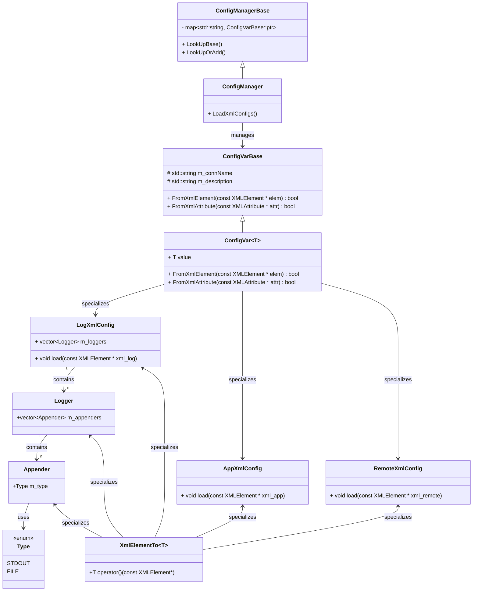
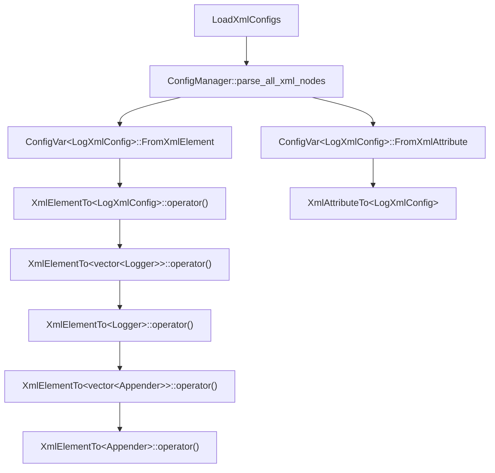

# 配置系统

## 配置系统介绍

实现了强类型XML配置反序列化框架，利用SFINAE与模板特化支持任意类型的序列化/反序列化。

- 类型安全：通过读取XML并自动映射到C++的强类型变量，使得在编译期/运行期（服务器启动时）都能发现类型不匹配问题。
- 可扩展：通过模板特化实现不同配置类型的专属解析逻辑，结合全局注册机制，实现了配置项的灵活扩展与统一管理，确保配置解析与管理职责清晰且可扩展性强。
- **职责分离**：`XmlElementTo<AppXmlConfig>`负责解析，`AppXmlConfig`负责存储。每个配置项（如 `AppXmlConfig`、`LogXmlConfig`）独立封装，职责单一，结构清晰。
- 集中式配置管理：通过 `ConfigManager` 统一管理所有配置项，支持全局访问（如 `g_app_config`），简化配置项查找与更新。

## 配置系统的类图

## 加载日志配置的流程图

