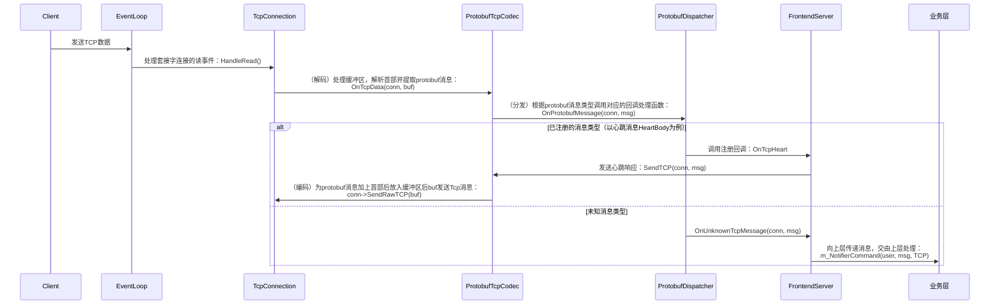
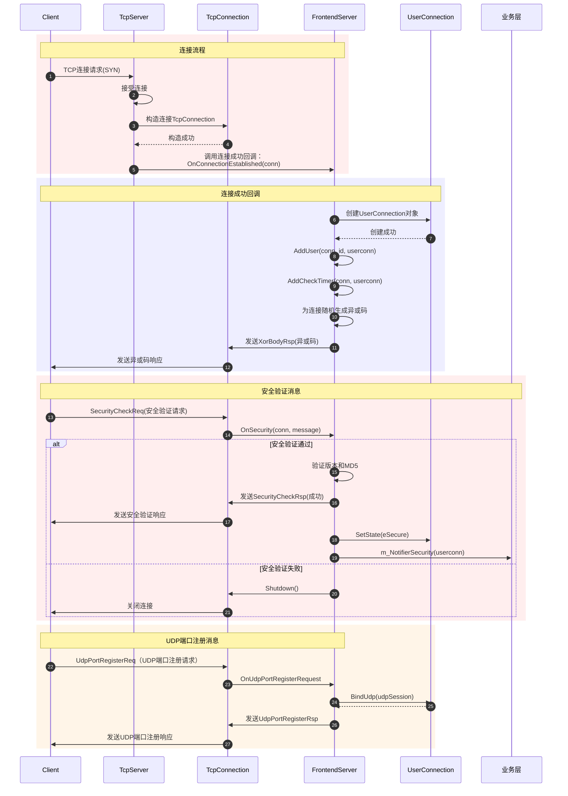
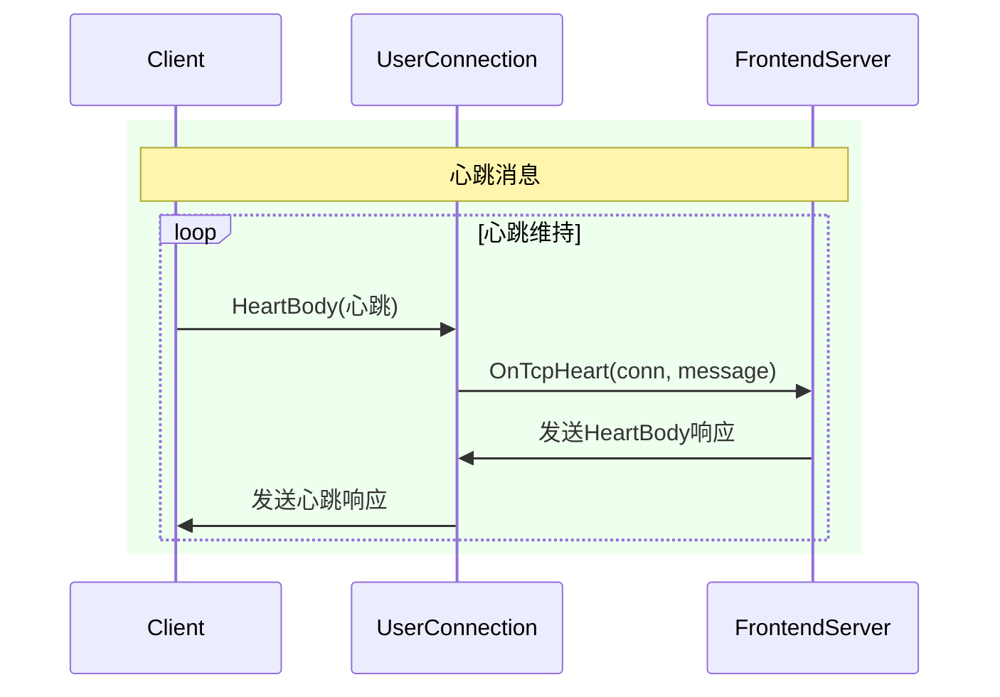
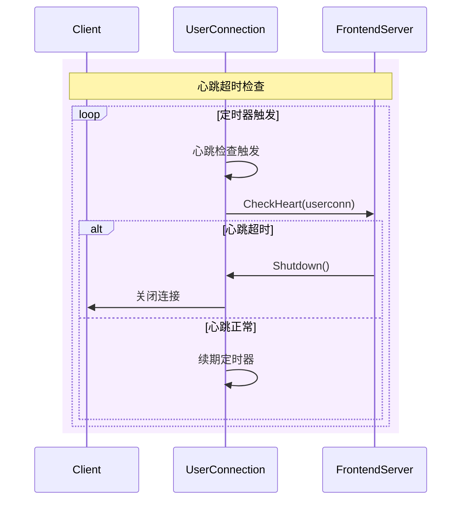
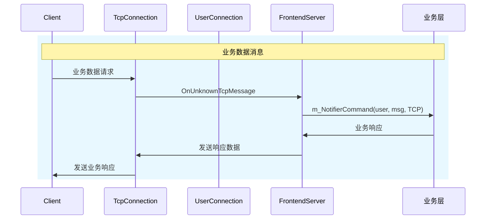

# 接入服务器

## 消息类型

## 消息编解码与分发时序图（TCP与UDP类似，仅以TCP为例）

```mermaid
sequenceDiagram
    participant Client
    participant EventLoop
    participant TcpConnection
    participant ProtobufTcpCodec
    participant ProtobufDispatcher
    participant FrontendServer
    participant BusinessLayer as 业务层

    Client->>EventLoop: 发送TCP数据
    EventLoop->>TcpConnection: 处理套接字连接的读事件：HandleRead()
    TcpConnection->>ProtobufTcpCodec: （解码）处理缓冲区，解析首部并提取protobuf消息：<br>OnTcpData(conn, buf)
    ProtobufTcpCodec->>ProtobufDispatcher: （分发）根据protobuf消息类型调用对应的回调处理函数：<br>OnProtobufMessage(conn, msg)
    alt 已注册的消息类型（以心跳消息HeartBody为例）
        ProtobufDispatcher->>FrontendServer: 调用注册回调：OnTcpHeart
        FrontendServer->>ProtobufTcpCodec: 发送心跳响应：SendTCP(conn, msg)
        ProtobufTcpCodec ->> TcpConnection: （编码）为protobuf消息加上首部后放入缓冲区后buf发送Tcp消息：<br>conn->SendRawTCP(buf)
    else 未知消息类型
        ProtobufDispatcher->>FrontendServer: OnUnknownTcpMessage(conn, msg)
        FrontendServer->>BusinessLayer: 向上层传递消息，交由上层处理：<br>m_NotifierCommand(user, msg, TCP)
    end
```

## 连接协议时序图

```mermaid
sequenceDiagram
	autonumber
    participant Client
    participant TcpServer
    participant TcpConnection
    participant FrontendServer
    participant UserConnection
    participant BusinessLayer as 业务层

	rect rgba(255, 200, 200, 0.3)
        Note over Client, FrontendServer: 连接流程
        Client->>TcpServer: TCP连接请求(SYN)
        TcpServer->>TcpServer: 接受连接
        TcpServer->>TcpConnection: 构造连接TcpConnection
        TcpConnection-->>TcpServer: 构造成功
        TcpServer->>FrontendServer: 调用连接成功回调：<br>OnConnectionEstablished(conn)
    end
 
    rect rgba(200, 200, 255, 0.3)
        Note over Client, UserConnection: 连接成功回调
        FrontendServer->>UserConnection: 创建UserConnection对象
        UserConnection-->>FrontendServer: 创建成功
        FrontendServer->>FrontendServer: AddUser(conn_id, userconn)
        FrontendServer->>FrontendServer: AddCheckTimer(conn, userconn)
        FrontendServer->>FrontendServer: 为连接随机生成异或码
        FrontendServer->>TcpConnection: 发送XorBodyRsp(异或码)
        TcpConnection->>Client: 发送异或码响应
    end
     
    rect rgba(255, 200, 200, 0.3)
        Note over Client, BusinessLayer: 安全验证消息
        Client->>TcpConnection: SecurityCheckReq(安全验证请求)
        TcpConnection->>FrontendServer: OnSecurity(conn, message)
    
        alt 安全验证通过
            FrontendServer->>FrontendServer: 验证版本和MD5
            FrontendServer->>TcpConnection: 发送SecurityCheckRsp(成功)
            TcpConnection->>Client: 发送安全验证响应
            FrontendServer->>UserConnection: SetState(eSecure)
            FrontendServer->>BusinessLayer: m_NotifierSecurity(userconn)
        else 安全验证失败
            FrontendServer->>TcpConnection: Shutdown()
            TcpConnection->>Client: 关闭连接
        end
    end
 
    rect rgba(255, 220, 180, 0.3)
        Note over Client, FrontendServer: UDP端口注册消息
        Client->>TcpConnection: UdpPortRegisterReq（UDP端口注册请求）
        TcpConnection->>FrontendServer: OnUdpPortRegisterRequest
        FrontendServer->>UserConnection: BindUdp(udpSession)
        UserConnection-->>FrontendServer: 
        FrontendServer->>TcpConnection: 发送UdpPortRegisterRsp
        TcpConnection->>Client: 发送UDP端口注册响应
    end
```

## 心跳时序图

#### 心跳消息时序图

```mermaid
sequenceDiagram
    participant Client
    participant UserConnection
    participant FrontendServer
    
    rect rgba(200, 255, 200, 0.3)
        Note over Client, FrontendServer: 心跳消息
        loop 心跳维持
            Client->>UserConnection: HeartBody(心跳)
            UserConnection->>FrontendServer: OnTcpHeart(conn, message)
            FrontendServer->>UserConnection: 发送HeartBody响应
            UserConnection->>Client: 发送心跳响应
        end
    end
```

#### 心跳检查时序图

```mermaid
sequenceDiagram
    participant Client
    participant UserConnection
    participant FrontendServer

    rect rgba(230, 200, 255, 0.3)
        Note over Client, FrontendServer: 心跳超时检查
        loop 定时器触发
            UserConnection->>UserConnection: 心跳检查触发
            UserConnection->>FrontendServer: CheckHeart(userconn)
            alt 心跳超时
                FrontendServer->>UserConnection: Shutdown()
                UserConnection->>Client: 关闭连接
            else 心跳正常
                UserConnection->>UserConnection: 续期定时器
            end
        end
    end
```

## 业务消息时序图

```mermaid
sequenceDiagram
    participant Client
    participant TcpConnection
    participant UserConnection
    participant FrontendServer
    participant BusinessLayer as 业务层
  
    rect rgba(180, 230, 255, 0.3)
        Note over Client, BusinessLayer: 业务数据消息
        Client->>TcpConnection: 业务数据请求
        TcpConnection->>FrontendServer: OnUnknownTcpMessage
        FrontendServer->>BusinessLayer: m_NotifierCommand(user, msg, TCP)
        BusinessLayer->>FrontendServer: 业务响应
        FrontendServer->>TcpConnection: 发送响应数据
        TcpConnection->>Client: 发送业务响应
    end
```

