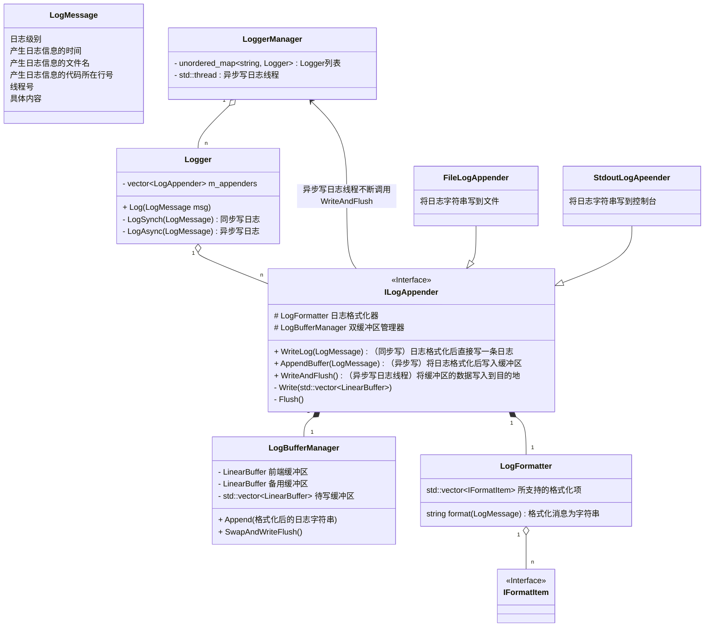
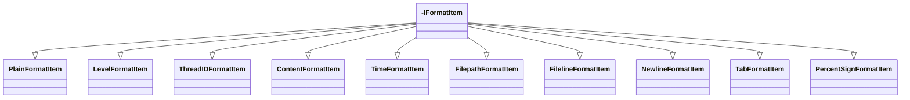
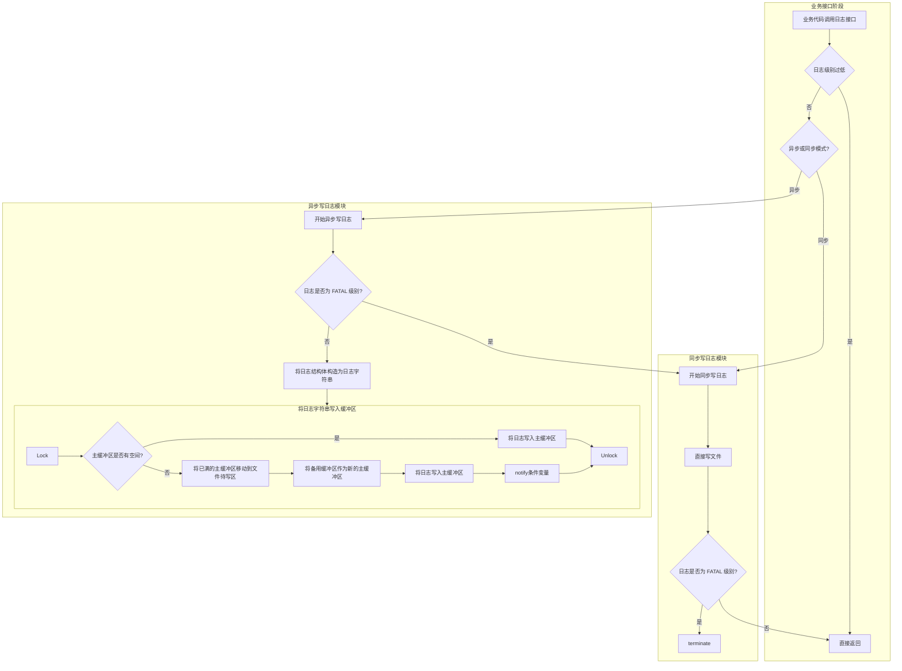
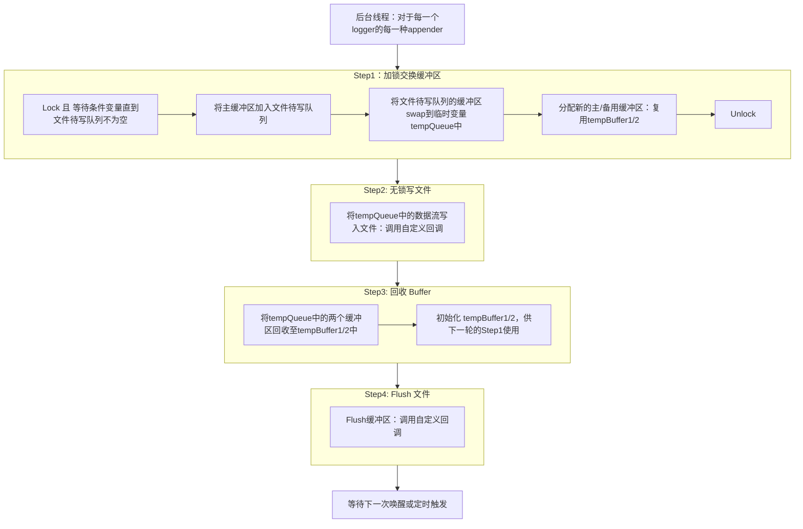

# 日志系统

## 文件组织结构

- `log.h`：实现了`LogLevel`、`LogMessage`、`Logger`和`LoggerManager`类，并向外部提供基于C++20的`std::format`式接口。

  - `LogLevel`：支持TRACE、DEBUG、INFO、WARN、ERROR、FATAL六种级别
  - `LogMessage`：一条日志分为日志级别、产生日志信息的时间、产生日志信息的文件名、产生日志信息的代码所在行号、线程号、具体内容。
  - `Logger`：支持同步写和异步写的日志器。
  - `LoggerManager`：管理所有日志器，缓冲区中的所有日志字符串通过一个单独的写日志线程写入到目的地。

- `LogFormatter.h`：利用多态实现日志格式的自定义。

- `LogBufferManager.h`：双缓冲区管理类。

  > ###### 为什么要用双缓冲区，而不用单缓冲区
  >
  > - ==**假设只有单缓冲区：业务线程写日志时，如果缓冲区满了，就必须阻塞等待后台线程写完。**== 
  > - **使用双缓冲后：当前缓冲区满时，业务线程无需等待，直接切换到备用缓冲区继续写。写满的缓冲区就交给后台线程写文件。** 

- `ILogAppender.h`：提供了同步写日志和异步写日志的通用接口。

  - `FileLogAppender.h`：支持将日志写入文件，使用`::writev`。

  - `StdoutLogApeender.h`：支持将日志写入控制台，使用`std::cout`。

## 类图

## 业务线程执行流

## 后台写日志线程执行流

