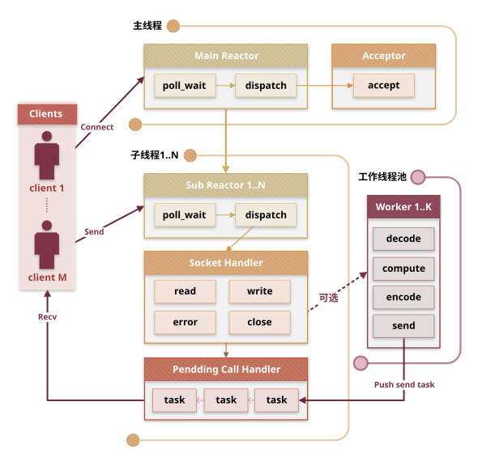
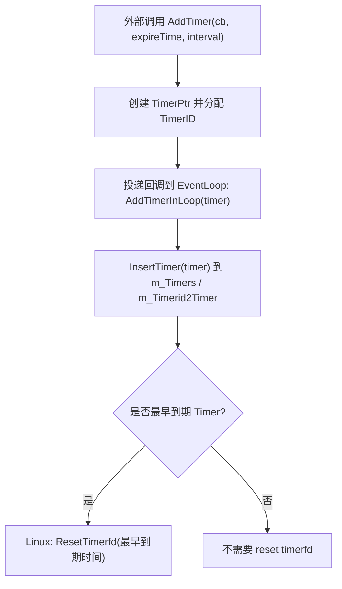
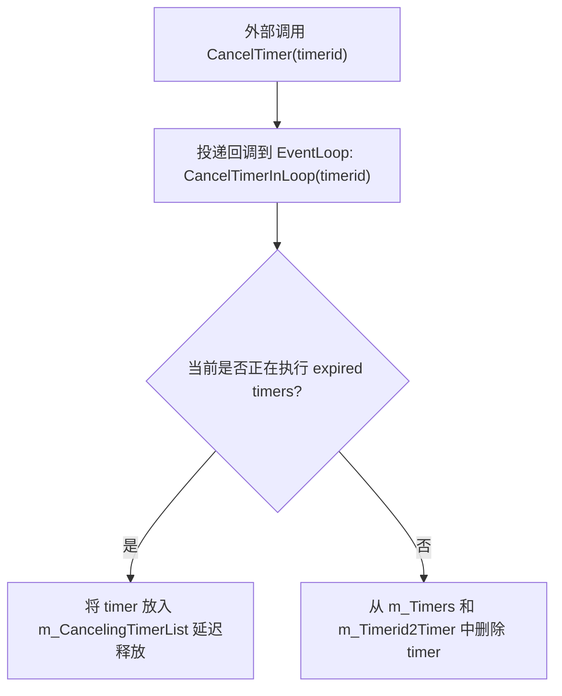
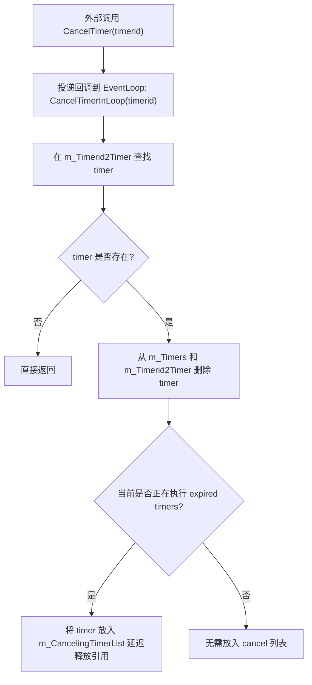
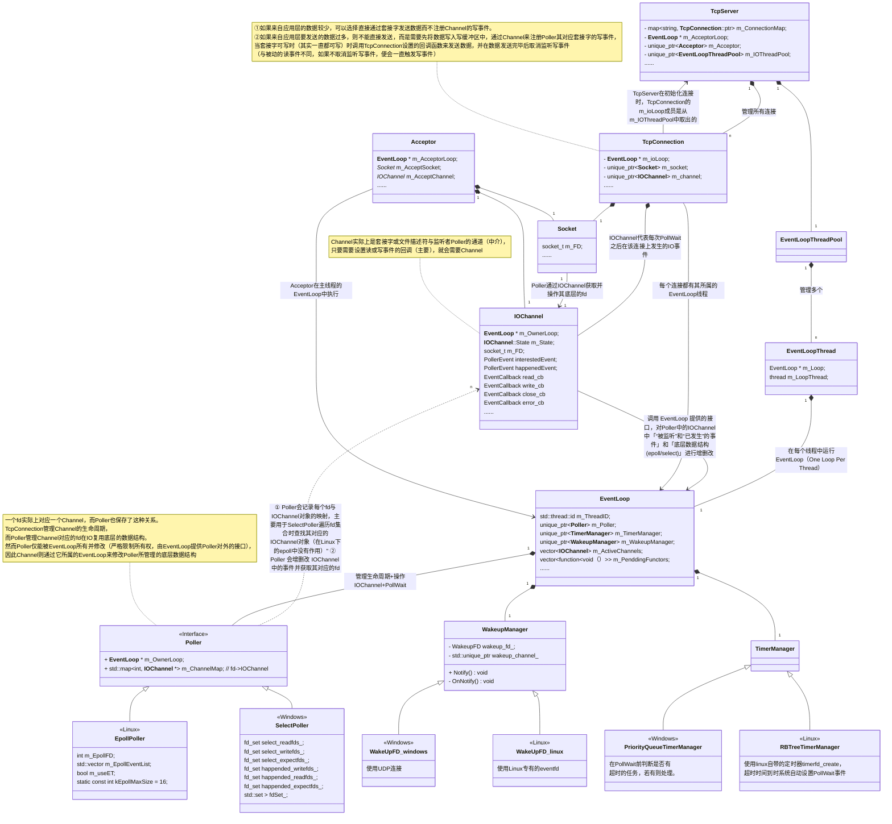
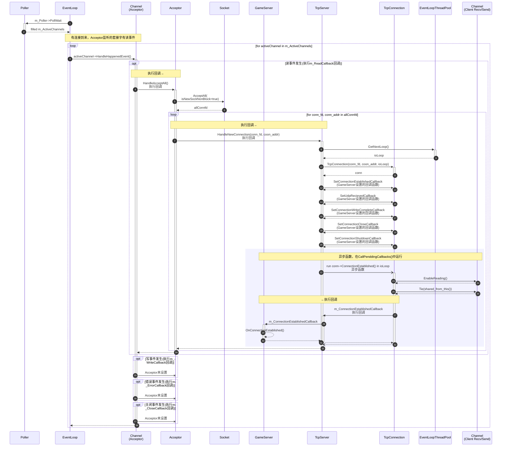
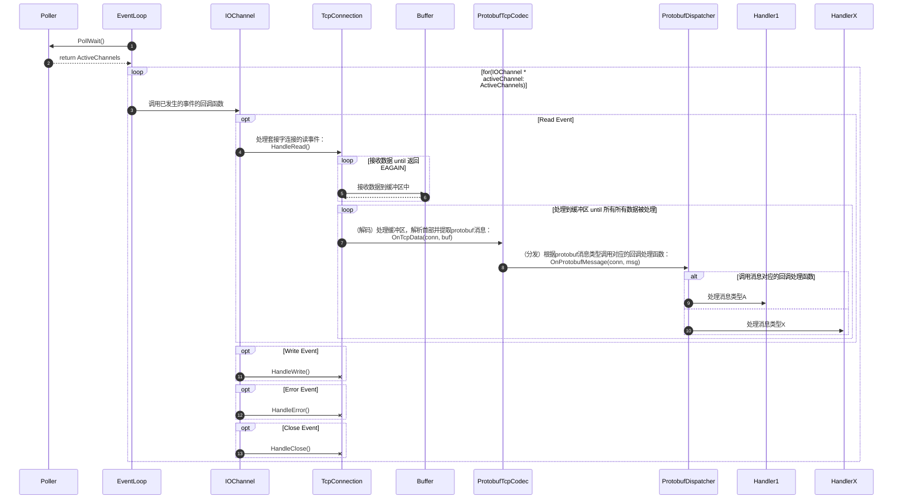
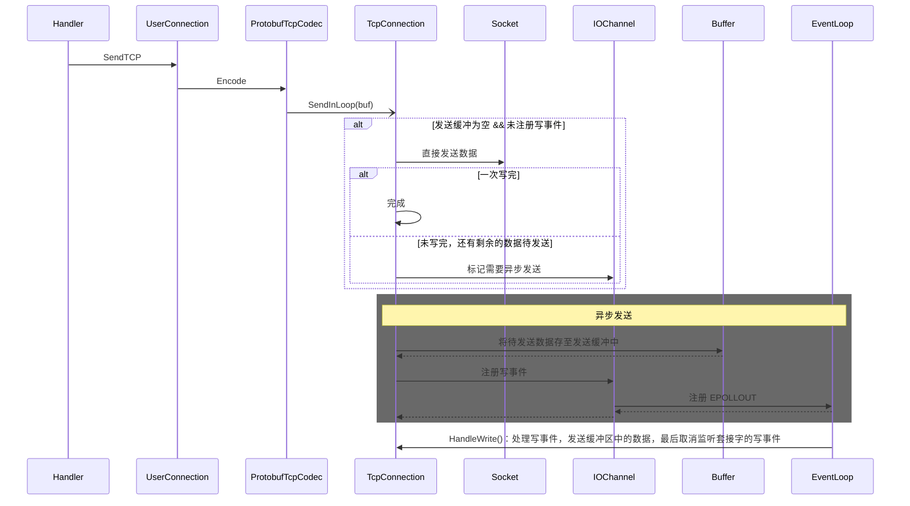

# 网络层

## 网络层概念

### 主从Reactor

| 特性               | 主Reactor（Main Reactor）          | 从Reactor（Sub Reactor）                |
| ------------------ | ---------------------------------- | --------------------------------------- |
| 任务               | 负责接受新连接                     | 负责已建立连接的读写事件处理            |
| 线程数             | 1                                  | M                                       |
| 事件               | 监听套接字的可读事件（新连接到来） | 客户端套接字的读写事件                  |
| I/O 类型           | 非阻塞 I/O                         | 非阻塞 I/O                              |
| 多路复用           | epoll(ET) / select                 | epoll (ET) / select                     |
| 框架中所对应的实体 | 运行`EventLoop::Loop()`的主线程    | `EventLoopThread`类型对象所管理的子线程 |

### 事件循环`EventLoop`

Reactor的实现基于*One Loop per Thread*思想，即在**每个线程中只运行一个事件循环**(`EventLoop::Loop()`)。

#### 事件循环执行步骤

一个Reactor中运行的事件循环包含以下步骤：

1. **等待事件（poll_wait）**：使用 I/O 多路复用机制（如`epoll`、`select`）阻塞等待事件。

   - Linux下：使用基于ET的`epoll`
   - Windows下：使用`select`

2. **分发事件（dispatch）**：事件到来后，循环遍历事件列表，将事件交给对应**回调函数**处理。

3. **执行套接字事件回调（网络IO任务）（handler）**：执行套接字的关闭、错误、读、写事件的回调函数。

   读事件处理：

   - **LT 模式**：只要套接字上还有可读/可写数据，`epoll_wait` 每次都会返回该事件。
   - **ET 模式**：必须循环读/写直到返回 `EAGAIN`，否则可能漏掉数据。

4. **运行代办函数（非网络IO任务）（worker）**：执行其它线程提交的任务或上一步的回调函数中提交延迟任务。

5. **继续循环**：回到步骤1，使得事件循环不断运行，形成**单线程异步 I/O 循环**。

#### 代办函数（Pending Calls）

> *代办函数（Pending Call/Pending Functor）*指的是：由其他线程或当前线程投递到某个EventLoop中，等待在该EventLoop线程里执行的函数任务。

##### wakeup 机制

如果 EventLoop 正在`epoll_wait`上阻塞，其他线程投递了 Pending Call，怎么办？

解决方案：使用 **wakeup 机制** 主动唤醒 EventLoop，使其立即处理 Pending Calls

- Linux：使用`eventfd`
- Windows：使用 UDP socket pair

> 因为wakeup机制可以取消线程在`epoll_wait`上阻塞，因此也会被用于**退出事件循环**。

## 网络层类介绍

### 一、核心网络层类

| 类名            | 主要作用              | 关键职责说明                                                 |
| --------------- | --------------------- | ------------------------------------------------------------ |
| `TcpClient`     | TCP 客户端统一入口    | 主动发起连接；管理单个`TcpConnection`；处理重连逻辑；对外提供连接状态与回调接口 |
| `Connector`     | 主动连接发起器        | 非阻塞连接；监听连接建立/失败事件；用于`TcpClient`建立连接   |
| `TcpServer`     | TCP 服务端统一入口    | 管理所有`TcpConnection`；持有`Acceptor`；将新连接分发到 I/O 线程；负责服务端连接生命周期 |
| `Acceptor`      | 被动连接接收器        | 监听 listen socket；在主Reactor中接收新连接；创建`TcpConnection`并通知`TcpServer` |
| `TcpConnection` | 表示一条 TCP 连接     | 封装 socket + `IOChannel`；维护读写缓冲区与连接状态；在所属`EventLoop`中处理网络I/O |
| `Socket`        | 套接字 RAII 封装      | 封装 socket fd 生命周期；提供`bind`/`connect`/`listen`/`shutdown`等基础操作 |
| `UdpServer`     | UDP 服务端 / 通信入口 | 管理 UDP socket；处理`recvfrom`/`sendto`；提供基于`EventLoop`的事件驱动 UDP 通信 |

### 二、事件循环与调度核心

| 类名        | 主要作用               | 关键职责说明                                                 |
| ----------- | ---------------------- | ------------------------------------------------------------ |
| `IOChannel` | fd 与事件/回调的绑定体 | `IOChannel` 是对单个文件描述符的事件抽象（如（可读、可写、关闭、错误），它不负责I/O读写本身，而是管理该 fd 上的事件感兴趣状态，并将发生的事件分发给对应的回调函数。 |
| `Poller`    | I/O 多路复用抽象接口   | `Poller` 管理和监控多个文件描述符的 I/O 事件，并将事件交给对应 `IOChannel` 执行回调，实现 Reactor 的事件分发核心功能。 |
| `EventLoop` | 事件循环与调度中心     | `EventLoop` 在单线程中循环等待事件、调度 I/O 与定时任务、执行代办函数，是 Reactor 模型中事件驱动和线程安全的核心执行器。 |

#### IOChannel

`IOChannel` 是 Reactor 模型中对单个文件描述符（fd）的事件抽象，负责：

- **事件回调**：注册底层文件描述符(fd)上的 read/write/close/error 事件对应的回调函数。
- **事件管理**：通过 `EventLoop` 通知 `Poller` 对「希望监听的事件（InterestedEvent）」进行增、删、改（同时也会管理底层的I/O 多路复用结构）
- **事件分发**：在 `Poller::PollWait` 返回已发生事件（HappenedEvent）后，按事件类型触发对应回调
- **生命周期安全**：==通过 `weak_ptr` 绑定 `TcpConnection`，在事件处理期间临时提升为 `shared_ptr`，以**防止事件回调执行过程中业务对象因引用计数清零而被销毁**。==

#### Poller

`Poller` 是 **Reactor 模型中 EventLoop 的事件管理器**，负责对 **多个文件描述符的 I/O 事件进行统一管理和调度**，它与 `IOChannel` 协作完成事件驱动：

- **事件等待**：使用底层 I/O 多路复用机制（如 `epoll`、`poll` 或 `select`）阻塞等待多个文件描述符上的事件。
- **事件映射**：维护 `fd -> IOChannel*` 的映射关系，使每个发生事件的文件描述符都能找到对应的 `IOChannel`。
- **事件分发**：`PollWait` 返回底层 I/O 多路复用中的已发生事件后，`Poller` 将这些事件分发到对应 `IOChannel`，由 `IOChannel` 触发注册的回调函数。
- **状态管理**：管理 `IOChannel` 的状态（新建、已添加、已删除），并将状态变化同步到底层 I/O 多路复用机制（如 epoll 内核表）中。

> 不同平台的 I/O 多路复用类`Poller`的实现：
>
> | 类名           | 平台          | 主要作用                                |
> | -------------- | ------------- | --------------------------------------- |
> | `EpollPoller`  | Linux         | 基于 epoll 实现`Poller`；支持 ET 模式； |
> | `SelectPoller` | Windows/Linux | 基于 select 实现`Poller`；              |

#### EventLoop

`EventLoop` 是 **Reactor 模型中的核心循环组件**，负责 **在单线程中调度和管理各种事件**，它协调 `Poller`、`IOChannel`、定时器和代办函数，保证事件驱动和线程安全：

- **事件循环**：通过调用 `Poller::PollWait` 阻塞等待 I/O 事件，并在事件发生后交给对应 `IOChannel` 执行回调。
- **事件管理接口**：提供 `UpdateChannel`、`RemoveChannel`、`HasChannel` 等接口，让 `IOChannel` 可以注册、更新或删除自身在 `Poller` 中的事件。
- **定时器管理**：通过 `TimerManager` 提供定时任务能力，包括延迟执行、周期执行、取消定时器等。
- **任务投递**：维护跨线程或本线程投递的任务队列（代办函数队列)，在事件循环中安全执行，确保线程安全。
- **线程绑定与生命周期管理**：保证循环只能在创建线程中执行，并支持通过 `WakeupManager` 唤醒阻塞的 `PollWait`（用于任务执行或退出循环）。

### 三、线程与Reactor扩展

| 类名                  | 主要作用                                         | 关键职责说明                                                 |
| --------------------- | ------------------------------------------------ | ------------------------------------------------------------ |
| `EventLoopThreadPool` | I/O 线程池                                       | 管理多个`EventLoopThread`；提供负载均衡的`EventLoop`分配     |
| `EventLoopThread`     | `EventLoop`所属线程                              | 在线程中创建并运行`EventLoop`；遵循 One Loop per Thread      |
| `WakeupManager`       | 提供wakeup机制，唤醒正在`epoll_wait`上阻塞的线程 | 实现`EventLoop`的跨线程唤醒；配合代办函数使用；     - Linux：使用 eventfd 实现高效唤醒     - Windows：使用 UDP socket pair 实现唤醒 |

### 四、定时器系统

| 类名                        | 平台    | 主要作用                                        |
| --------------------------- | ------- | ----------------------------------------------- |
| `TimerManager`              | 抽象    | 统一定时器管理接口；由`EventLoop`驱动           |
| `RBTreeTimerManager`        | Linux   | 基于 timerfd+红黑树：超时自动触发`Poller`读事件 |
| `PriorityQueueTimerManager` | Windows | 基于优先队列：在`PollWait`前主动检查超时任务    |

#### RBTreeTimerManager：红黑树实现

##### 实现定时器的数据结构

| 成员                       | 类型                                  | 作用                                 | 注意点                                    |
| -------------------------- | ------------------------------------- | ------------------------------------ | ----------------------------------------- |
| `m_Timers`                 | `std::set<TimerPtr, TimerComparator>` | 红黑树管理所有定时器，按到期时间排序 | Comparator 要严格弱序，避免重复定时器被吞 |
| `m_Timerid2Timer`          | `unordered_map<TimerID, TimerPtr>`    | 按 ID 快速查找 / cancel              | 必须与 m_Timers 保持同步                  |
| `m_CancelingTimerList`     | `unordered_map<TimerID, TimerPtr>`    | 回调中 cancel 延迟释放               | 必须在 ResetAndFreeExpiredTimers 清空     |
| `m_IsCallingExpiredTimers` | `atomic_bool`                         | 标记是否正在执行 expired timer       | 单线程下可以换 bool                       |
| `m_TimerfdManager`         | `unique_ptr<__TimerfdManager>`        | Linux timerfd 封装                   | 每次最早 timer 改变都要 reset             |

###### 1️⃣ `std::set<TimerPtr, TimerComparator> m_Timers`

**作用**：

- 核心定时器容器，使用 **红黑树** 管理所有有效定时器。
- 自动按照定时器到期时间排序，保证 **最早到期的定时器始终在树的最前面**。
- 支持高效操作：插入、删除和查找最早到期定时器都具有 **O(log n)** 时间复杂度。

**实现细节**：

- **插入**：`InsertTimer` 会将新的定时器加入红黑树，自动按到期时间排序。
- **获取和删除过期定时器**：`PopExpiredTimers` 会从树的前端一直取到当前时间点，取出的定时器即为过期定时器，并从红黑树中删除。
- **定制比较器**：`TimerComparator` 保证弱顺序（strict weak ordering），即使两个定时器到期时间相同也不会被认为“相等”，避免重复定时器被吞掉。
- **性能保证**：红黑树自平衡机制确保大规模定时器管理依然高效，插入和删除操作都是 O(log n)。

###### 2️⃣ `std::unordered_map<TimerID, TimerPtr> m_Timerid2Timer`

**作用**：

- 按 **定时器 ID** 快速查找定时器，==用于支持 `CancelTimer(timerid)` 操作无需在红黑树中线性扫描被删除的timer==，性能显著提升。
- 逻辑上是 `m_Timers` 的 **索引副本**：set 按时间排序，map 按 ID 索引，二者互补。

**实现细节**：

- **插入**：每次向 `m_Timers` 插入定时器时，同时将定时器插入 `m_Timerid2Timer`。
- **删除**：取消定时器或过期定时器时，需要同时从 set 和 map 中删除。
- **查找**：通过定时器 ID 可在 O(1) 时间内找到对应的 TimerPtr，然后再进行删除或其他操作。

**注意点**：

- **保持一致性**：必须保证红黑树和 map 的插入/删除同步，否则可能出现定时器存在于一个容器中，但在另一个容器中找不到的情况。
- **逻辑清晰**：map 不负责定时器排序，仅用于快速查找和取消；set 负责时间排序和过期处理。

###### 3️⃣ `std::unique_ptr<detail::__TimerfdManager> m_TimerfdManager`

**作用**：

- 封装 Linux **timerfd 文件描述符**，负责向 EventLoop 通知定时器到期事件。
- 配合红黑树管理定时器，实现 **逻辑管理 + 内核唤醒** 的组合：
  - **红黑树**：存储所有定时器，按到期时间排序
  - **timerfd**：只关注最早到期的定时器，通过内核事件触发唤醒

**工作流程**：

1. **初始化**：在构造时创建 timerfd，并绑定回调给 EventLoop，保证当最早到期的定时器到时，EventLoop 会执行相应处理函数。
2. **插入新的定时器**：当新插入的定时器成为最早到期的定时器时，timerfd 会被更新为新的到期时间，从而保证 EventLoop 会在正确时间被唤醒。
3. **处理到期定时器后**：在处理完所有到期定时器后，timerfd 会被重置为下一个最早到期定时器的时间，保证下一次唤醒的准确性。

##### 防止定时器自cancel的数据结构

> 使用**延迟删除**来防止定时器在到期回调中cancel自身，导致迭代器失效的问题。
>
> ⚠️实际上不会出现该问题，因为到期定时器会被全部同一pop到一个新的列表中，即使cancel自身也不会操作该列表，因此也不会导致迭代器失效。 

| 成员                       | 作用                                                         |
| -------------------------- | ------------------------------------------------------------ |
| `m_IsCallingExpiredTimers` | 标记是否正在执行回调，用来判断 cancel 是否放入列表           |
| `m_CancelingTimerList`     | 保存回调中被 cancel 的 timer，**可以选择不立即删除**（延迟释放），更清晰表达逻辑 |

- 如果定时器的到期回调涉及cancel定时器，因此选择**延迟cancel timer**策略。在过期回调执行完毕后，统一删除。

##### 定时器「添加」流程图

##### 定时器「取消」流程图

##### 定时器「到期」流程图

## 网络层UML类图

## 调用流程图

### 接受用户连接的过程

`Acceptor::HandleAcceptAll`的channel读回调与`TcpServer::HandleNewConnection`回调 

### 读事件的调用流程图

### 写事件的调用流程图

- send：能直接发就直接发，发不完就进发送缓冲区+监听写事件（异步发送）

## 杂项

### one-loop per-thread模型无需`EPOLLONESHOT`

> - `EPOLLONESHOT`的含义：`EPOLLONESHOT` 是 `epoll` 的一个事件选项，表示**某个文件描述符上的事件只会触发一次**。事件被触发后，`epoll` 会自动将其从监听队列中禁用，**必须手动通过 `epoll_ctl(..., EPOLL_CTL_MOD, ...)` 重新激活**，才能再次监听该 fd 的事件。
>
> - `EPOLLONESHOT`的作用：**对于`one-loop multi-thread`模型，防止多个线程同时处理同一个socket所带来的数据竞争**。

本框架采用的是 **“one-loop per-thread”** 模型，每个TCP连接的套接字只在所属的 `EventLoop`（即一个IO线程）中处理事件，即一个连接只会被一个IO线程处理，处理完之后传递给上层的工作线程 ———— 然后继续处理该连接的IO事件。**天然避免了多个线程同时操作同一个连接的问题**，因此无需设置`EPOLLONESHOT`选项。

