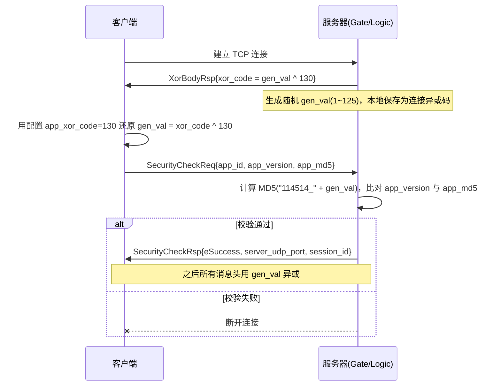

# 通信协议与客户端对接说明

> 本文档讲解 GameServer 的**网络通信协议**：消息帧格式、加密握手流程、
> 消息命令全集、核心 protobuf 消息定义，以及 Unity 客户端（`ThirdPersonDemo`）
> 对接时需要注意的要点。服务间业务流程时序见 [`workflow.md`](./workflow.md)。

## 一、协议栈概览

| 层 | 内容 |
|----|------|
| 传输 | TCP（控制/可靠性消息）+ UDP（高频状态同步） |
| 帧格式 | 自定义 8 字节消息头 + protobuf 序列化消息体 |
| 序列化 | Protobuf（`protobuf/*.proto`，生成 `.pb.cc/.pb.h`） |
| 加密 | 消息头 8 字节与异或码逐字节异或；**消息体明文** |
| 消息分发 | 消息头中的 `type_cmd` 对应 `msg_cmd.proto` 的 `MessageCommand` 枚举 |

## 二、消息帧格式（`MessageHeader_Cmd`）

定义于 `core/frontend/MessageHeader_Cmd.h`，线格式为 **8 字节定长头 + 变长 body**：

```
┌─────────────┬─────────────┬─────────────────┬──────────────────────┐
│ check_code  │  type_cmd   │   body_length   │   protobuf body      │
│   2 字节     │   2 字节     │    4 字节        │   body_length 字节    │
└─────────────┴─────────────┴─────────────────┴──────────────────────┘
```

| 字段 | 大小 | 说明 |
|------|------|------|
| `check_code` | 2B | 协议校验码，取配置 `checkCode="DE"`（`config/configs_*.xml`） |
| `type_cmd` | 2B | 消息类型，取值即 `MessageCommand` 枚举（见第五节） |
| `body_length` | 4B | 消息体长度（protobuf 序列化后的字节数） |

- **字节序**：数值字段按网络字节序处理（由 `net/Endian.h` 负责主机/网络序转换）。
- **加密**：头部的 `check_code`、`type_cmd`、`body_length` 每个字节都与**异或码**异或；
  消息体（protobuf 明文）**不加密**。异或码的协商见下节。

> ⚠️ 注意：`core/GameProtocol.h` 里的注释是旧版格式（`check 2B + length 4B + cmd 2B`），
> 与当前实际代码（`check 2B + cmd 2B + length 4B`）**不一致**，以本节为准。

## 三、连接建立与安全握手（TCP）

客户端连上服务器后，必须先完成以下握手，再发业务消息：



关键点：

1. **异或码**：服务器生成随机 `gen_val`（范围 1~125），发送的是
   `gen_val ^ app_xor_code`；`app_xor_code` 为配置项 `appXorCode`（默认 `130`）。
   客户端需用 `130` 还原出 `gen_val`。
2. **MD5 校验**：服务器端期望的 MD5 为 `MD5("{security_code}_{gen_val}")`，
   即 `MD5("114514_" + 异或码)`（`security_code` 配置为 `114514`）。
   同时校验 `app_version`（配置 `appVersion`）。
3. **会话标识**：校验成功后返回 `session_id`（即连接 ID）与 `server_udp_port`（UDP 端口），
   供客户端后续做 UDP 端口注册。
4. **超时**：安全校验超时 10s、心跳超时 30s（配置 `maxSecurityTime` / `maxHeartTime`）。

## 四、UDP 通道与心跳

### 4.1 UDP 端口注册

TCP 连接建立会话后，客户端通过 TCP 上报自己的 UDP 地址，把 UDP 与 TCP 会话绑定：

```
Client --UdpPortRegisterReq{session_id, client_udp_ip, client_udp_port}--> Server(TCP)
Server --UdpPortRegisterRsp{session_id, status}--> Client
```

服务器校验 `session_id` 与 TCP 连接 ID 一致后，注册 UDP 会话，之后即可通过 UDP
收发该客户端的数据。

### 4.2 心跳

- 客户端每次 Update 发送 `MSG_HeartBody`（空消息体）心跳；
- 服务器同样回发心跳；超时（默认 30s）未收到则断开连接。

## 五、消息命令全集（`msg_cmd.proto`）

`type_cmd` 取值即 `MessageCommand` 枚举。按功能分四大类：

### 5.1 连接协议（500~505）

| 值 | 枚举 | 方向 | 消息体 | 说明 |
|----|------|------|--------|------|
| 500 | `MSG_HeartBody` | C↔S | `HeartBody`（空） | 心跳 |
| 501 | `MSG_XorBodyRsp` | S→C | `XorBodyRsp` | 下发异或码 |
| 502 | `MSG_SecurityCheckReq` | C→S | `SecurityCheckReq` | 安全校验请求 |
| 503 | `MSG_SecurityCheckRsp` | S→C | `SecurityCheckRsp` | 校验结果 + UDP 端口 + session_id |
| 504 | `MSG_UdpPortRegisterReq` | C→S | `UdpPortRegisterReq` | UDP 端口注册 |
| 505 | `MSG_UdpPortRegisterRsp` | S→C | `UdpPortRegisterRsp` | 注册结果 |

### 5.2 登录模块（1000~1005）

| 值 | 枚举 | 方向 | 消息体 |
|----|------|------|--------|
| 1000 | `MSG_LoginReq` | C→Gate→Account | `LoginReq` |
| 1001 | `MSG_LoginRsp` | Account→Gate→C | `LoginRsp` |
| 1002 | `MSG_RegisterReq` | C→Gate→Account | `RegisterReq` |
| 1003 | `MSG_RegisterRsp` | Account→Gate→C | `RegisterRsp` |
| 1004 | `MSG_QuitLoginReq` | C→Gate | `QuitLoginReq` |
| 1005 | `MSG_QuitLoginRsp` | Gate→C | `QuitLoginRsp` |

### 5.3 房间模块（2000~2504）

| 值 | 枚举 | 方向 | 消息体 |
|----|------|------|--------|
| 2000 | `MSG_CreateRoomReq` | C→Gate→Center | `CreateRoomReq` |
| 2001 | `MSG_CreateRoomRsp` | Center→Gate→C | `CreateRoomRsp` |
| 2002 | `MSG_SearchRoomReq` | C→Gate→Center | `SearchRoomReq` |
| 2003 | `MSG_SearchRoomRsp` | Center→Gate→C | `SearchRoomRsp` |
| 2004 | `MSG_SelfJoinRoomReq` | C→Gate→Center | `SelfJoinRoomReq` |
| 2005 | `MSG_SelfJoinRoomRsp` | Center→Gate→C | `SelfJoinRoomRsp` |
| 2006 | `MSG_SelfQuitRoomReq` | C→Gate→Center | `SelfQuitRoomReq` |
| 2007 | `MSG_SelfQuitRoomRsp` | Center→Gate→C | `SelfQuitRoomRsp` |
| 2008 | `MSG_OtherJoinRoomRsp` | S→C（房间广播） | `OtherJoinRoomRsp` |
| 2009 | `MSG_OtherQuitRoomRsp` | S→C（房间广播） | `OtherQuitRoomRsp` |
| 2010 | `MSG_GetEnterSceneTokenReq` | C→Gate→Center | `GetEnterSceneTokenReq` |
| 2011 | `MSG_GetEnterSceneTokenRsp` | Center→Gate→C | `GetEnterSceneTokenRsp` |
| 2300 | `MSG_BroadcastRoomReq` | Center→Gate（内部） | `BroadcastRoomReq` |
| 2301 | `MSG_BroadcastRoomRsp` | Gate→Center（内部） | `BroadcastRoomRsp` |
| 2500 | `MSG_NewRoomReq` | Center→Logic（内部） | `NewRoomReq` |
| 2501 | `MSG_NewRoomRsp` | Logic→Center（内部） | `NewRoomRsp` |
| 2503 | `MSG_DeleteRoomReq` | Center→Logic（内部） | `DeleteRoomReq` |
| 2504 | `MSG_DeleteRoomRsp` | Logic→Center（内部） | `DeleteRoomRsp` |

> 2000~2011 为**客户端可见**命令；2300/2500 段为**服务间内部 RPC** 使用的命令。

### 5.4 场景模块（3000~3011）

| 值 | 枚举 | 方向 | 通道 | 消息体 |
|----|------|------|------|--------|
| 3000 | `MSG_SceneLoginReq` | C→Logic | TCP | `SceneLoginReq` |
| 3001 | `MSG_SceneLoginRsp` | Logic→C | TCP | `SceneLoginRsp` |
| 3002 | `MSG_C2SEnterScene` | C→Logic | TCP | `C2SEnterScene` |
| 3003 | `MSG_S2CEnterScene` | Logic→C | TCP | `S2CEnterScene` |
| 3004 | `MSG_C2SLeaveScene` | C→Logic | TCP | `C2SLeaveScene` |
| 3005 | `MSG_S2CLeaveScene` | Logic→C | TCP | `S2CLeaveScene` |
| 3006 | `MSG_C2SMove` | C→Logic | **UDP** | `C2SMove` |
| 3007 | `MSG_S2CMove` | Logic→C | **UDP（广播）** | `S2CMove` |
| 3008 | `MSG_C2SJumpAndGravity` | C→Logic | **TCP** | `C2SJumpAndGravity` |
| 3009 | `MSG_S2CJumpAndGravity` | Logic→C | **TCP（广播）** | `S2CJumpAndGravity` |
| 3010 | `MSG_C2SOtherPlayerData` | C→Logic | TCP | `C2SOtherPlayerData` |
| 3011 | `MSG_S2COtherPlayerData` | Logic→C | TCP | `S2COtherPlayerData` |

> ⚠️ **通道不对称**：移动（`Move`）走 UDP，跳跃（`JumpAndGravity`）走 TCP，
> 客户端务必按表中通道发送，否则服务端无法正确接收。

## 六、核心 protobuf 消息定义

### 6.1 `connection.proto`（连接协议）

```protobuf
message XorBodyRsp          { uint32 xor_code = 1; }
message HeartBody           { }
message SecurityCheckReq    { uint32 app_id=1; uint32 app_version=2; string app_md5=3; }
message SecurityCheckRsp {
    enum ResultCode { eSuccess=0; eAppVersionFailed=1; eMd5Failed=2; }
    ResultCode result_code = 1;
    optional uint32 server_udp_port = 2;
    optional uint64 session_id = 3;   // 连接标识，仅 eSuccess 时有效
}
message UdpPortRegisterReq   { uint64 session_id=1; string client_udp_ip=2; uint32 client_udp_port=3; }
message UdpPortRegisterRsp   { uint64 session_id=1; enum Status{...} status=2; }
```

### 6.2 `account.proto` / `account_data.proto`（账号）

```protobuf
message AccountBaseData { uint64 uid=1; string username=3; }

message LoginReq    { string username=3; string password=4; }
message LoginRsp {
    enum Status { eSuccess=0; eAccountNotExist=1; ePasswordError=2;
                  eAlreadyLoggedIn=3; eUnknownError=4; }
    Status result_code = 1;
    AccountBaseData account_data = 2;
    string token = 3;              // 登录 token（UUID，TTL 30min）
}

message RegisterReq  { string username=3; string password=4; }
message RegisterRsp {
    enum Status { eSuccess=0; eAccountAlreadyExist=2; eUnknownError=3; }
    Status result_code = 2;
    uint64 uid = 4;
}

service AccountServiceRpc {
    rpc Login(LoginReq) returns(LoginRsp);
    rpc Register(RegisterReq) returns(RegisterRsp);
}
```

### 6.3 `room.proto` / `room_data.proto`（房间）

```protobuf
message RoomDetailData {
    uint64 room_id = 1;
    string name = 2;
    uint64 owner_uid = 3;
    uint32 capacity = 5;
    repeated AccountBaseData exist_player_datas = 7;
}

message CreateRoomReq  { AccountBaseData owner_data=1; string user_token=2;
                         string name=3; uint32 capacity=6; }
message CreateRoomRsp  { uint64 uid=1; Status result_code=2; RoomDetailData room_data=3;
                         string room_ip=4; uint32 room_port=5; }   // 逻辑服地址

message SearchRoomReq  { uint64 uid=1; string user_token=3; }
message SearchRoomRsp  { uint64 uid=1; repeated RoomDetailData room_datas=2; }  // 不含地址

message SelfJoinRoomReq  { AccountBaseData joinner_data=1; string user_token=2; uint64 room_id=3; }
message SelfJoinRoomRsp  { uint64 uid=1; Status result_code=2; RoomDetailData room_data=3;
                           string room_ip=4; uint32 room_port=5; }
message OtherJoinRoomRsp { AccountBaseData joinner_data=3; Status result_code=2; }

message SelfQuitRoomReq  { uint64 uid=1; string user_token=3; uint64 room_id=2; }
message SelfQuitRoomRsp  { ... }

message GetEnterSceneTokenReq { uint64 uid=1; string user_token=2; uint64 room_id=3; }
message GetEnterSceneTokenRsp { uint64 uid=1; Status result_code=2; uint64 room_id=3; string scene_token=4; }
```

> 建房/进房成功后返回的 `room_ip`/`room_port` 即 **LogicServer 的 TCP 前端地址**，
> 客户端需**直连**该地址完成场景登录（不再经过 GateServer）。

### 6.4 `game.proto` / `game_data.proto`（场景）

```protobuf
message Vector3_net      { float x=1; float y=2; float z=3; }
message Quaternion_net   { float x=1; float y=2; float z=3; float w=4; }
message Transform_net    { Vector3_net position=2; Quaternion_net rotation=3; }

message PlayerMove         { Transform_net transform=1; float ani_speed=5; float ani_motion_speed=6; }
message PlayerJumpAndGravity { bool ani_is_jump=2; bool ani_is_ground=3; bool ani_is_freefall=4; }
message PlayerBaseData {
    AccountBaseData account_data = 1;
    int32 state = 3;
    int32 hp_current = 4;
    int32 hp_max = 5;
    PlayerMove movement = 6;
    PlayerJumpAndGravity jump_and_gravity = 7;
}

message SceneLoginReq  { uint64 uid=1; uint64 room_id=2; string user_token=3; string scene_token=4; }
message SceneLoginRsp  { bool is_ok=1; }

message C2SEnterScene  { uint64 uid=1; uint64 room_id=2; }
message S2CEnterScene  { uint64 uid=1; uint64 room_id=2; bool result=3;
                         PlayerBaseData self_data=4; repeated PlayerBaseData other_datas=5; }

message C2SLeaveScene  { uint64 uid=1; uint64 room_id=2; }
message S2CLeaveScene  { uint64 uid=1; uint64 room_id=2; }

message C2SMove { uint64 uid=1; uint64 room_id=3; PlayerMove movement=2; }
message S2CMove { uint64 uid=1; uint64 room_id=3; PlayerMove movement=2; }

message C2SJumpAndGravity { uint64 uid=1; uint64 room_id=3; PlayerJumpAndGravity jump_and_gravity=2; }
message S2CJumpAndGravity { uint64 uid=1; uint64 room_id=3; PlayerJumpAndGravity jump_and_gravity=2; }
```

### 6.5 `rpc.proto`（服务间 RPC 通用封装）

```protobuf
message RpcMessage {
    enum Type   { REQUEST=0; RESPONSE=1; ERROR=2; }
    enum Status { NO_ERROR=0; WRONG_PROTO=1; NO_SERVICE=2; NO_METHOD=3;
                  INVALID_REQUEST=4; INVALID_RESPONSE=5; TIMEOUT=6; }
    Type type = 1;
    fixed64 id = 2;                 // 请求/响应关联 ID
    optional string service = 3;    // 服务名
    optional string method = 4;     // 方法名
    optional bytes request = 5;     // 请求体（内层 protobuf 序列化）
    optional bytes response = 6;    // 响应体
    optional Status error = 7;
}
```

服务间 RPC 的完整机制见 [`rpc.md`](./rpc.md)。

## 七、客户端对接要点（Unity / ThirdPersonDemo）

1. **先连 GateServer**（默认 `11111` TCP），完成握手 + 登录，拿到 `token`；
2. **建房/进房**后从响应里取 `room_ip`/`room_port`，**直连 LogicServer** 完成场景登录；
3. **场景登录**需携带 `user_token`（登录 token）与 `scene_token`（进房后请求的一次性 token）；
4. **移动走 UDP**、**跳跃走 TCP**，注意区分；UDP 需先通过 TCP 完成端口注册；
5. **消息头 8 字节**：`check_code(2B) + type_cmd(2B) + body_length(4B)`，头部异或，
   消息体为 protobuf 明文；
6. **每个 Update 发心跳**（`MSG_HeartBody`），否则 30s 后会被断开。

## 八、易误解之处

| 事项 | 说明 |
|------|------|
| `GameProtocol.h` 注释过时 | 旧格式 `check 2B+len 4B+cmd 2B` 与实际 `check 2B+cmd 2B+len 4B` 不符 |
| 消息体不加密 | 仅消息头 8 字节异或混淆，protobuf body 明文 |
| 移动/跳跃通道不同 | 移动 UDP、跳跃 TCP（见 5.4 节） |
| `SearchRoomRsp` 不含房间地址 | 房间地址在 `CreateRoomRsp` / `SelfJoinRoomRsp` 中返回 |
| `GetEnterSceneToken` 未校验房间归属 | 服务端实现恒返回 `eSuccess`（见 workflow 备注） |
