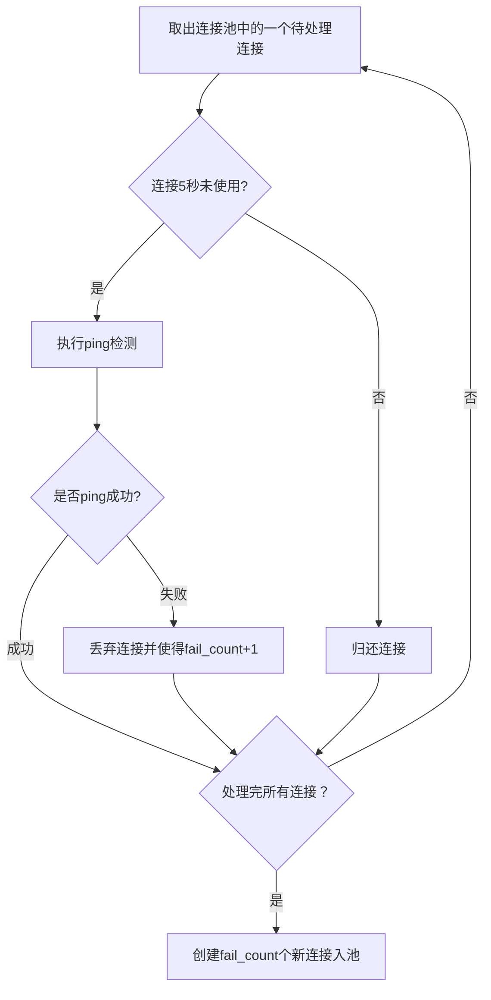

# Redis客户端

## Redis客户端简介

1. **Redis连接池实现**：基于Redis++管理会话连接，支持高并发连接复用。
2. **RAII 连接管理**：使用带自定义deleter的`std::shared_ptr`自动回收并归还连接。
3. **定时健康检查与自动重连**：周期性执行`ping`检测连接状态，异常时自动重建连接。

## 连接健康检查流程

```mermaid
graph TD
    B[取出连接池中的一个待处理连接]
    B --> C{连接5秒未使用?}
    C -->|是| D[执行ping检测]
    E -->|成功| I
    D --> E{是否ping成功?}
    E -->|失败| F[丢弃连接并使得fail_count+1]
    C -->|否| G[归还连接]
    G --> I{处理完所有连接？}
    F --> I
    I -->|是| J[创建fail_count个新连接入池]
    I -->|否| B
```

