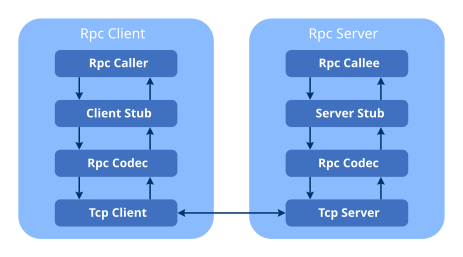
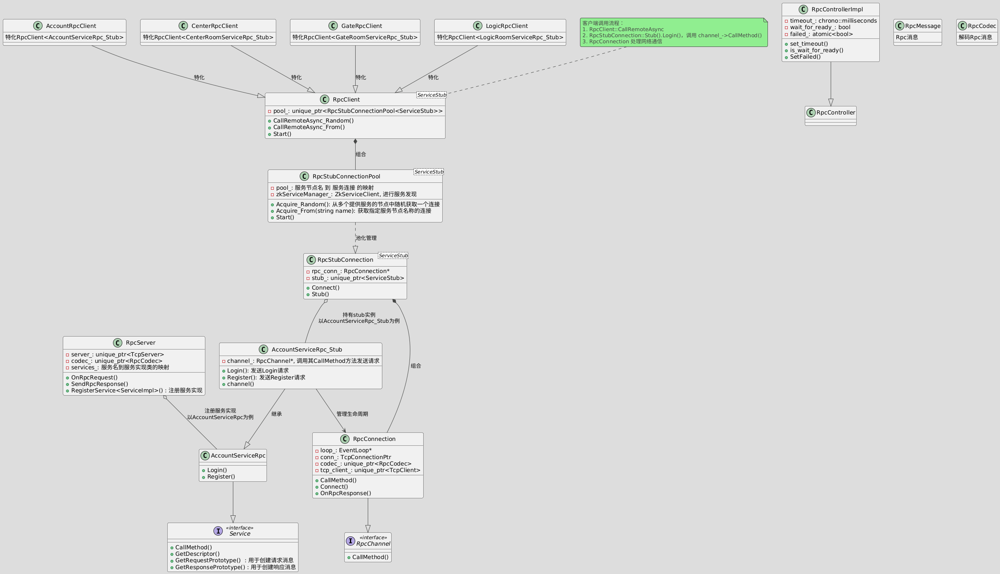
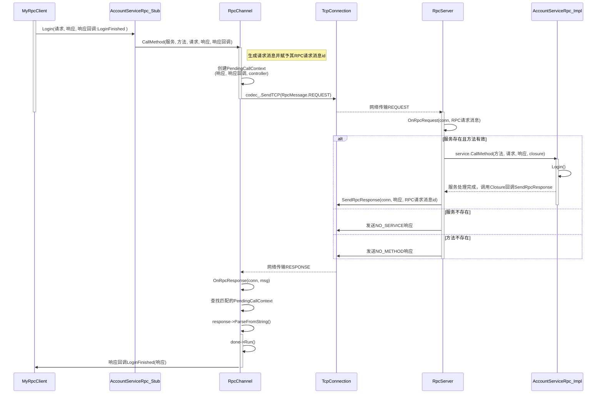

# 异步Rpc框架

## Rpc框架示意图



## UML类图



![UML](//www.plantuml.com/plantuml/png/ZLPRJzn657xthvW-9Q7TbTg-hP0LH9keKb0Zw5CLQMMy0rYrFOuzcugsaO0GkYJB1JL5rKA1ROX0hSf5g5nsIVRFUEpbYR_GOy-mjjTswPlddE-S-Svbpl5zXoeshHgwz16TmWP6b4nBqXt4jbj-SyPRViTMtagQIR4zeQWOZLhgy9HYcbX7WuCziIoZ7oM4FaR3YgwFO3f5AdVlISzZTcFOVgQf-5QZKF0Gqo-mezgQHOaToKRnqofsw6ERK4AdBNpt7a8bvB_PTrlBhBR1sgtkuPbtFEUTrhpPmyZAiOZfuBXPqehziiHQRuJLyo3u43jUdG3OjbTRzHlptkOIUzNqZzlNbpL_j-L-U7rzkIYfkk8uQ4XLITMa8aJ8a8Zh4PdKJ45_54zg3WGUfYNFhZn6g-EXSG6fFClbKYpb0v-Wxj4BeCvUdaP9yzOll9DVsShQrSmiJq3yzXBYcl38rGb24U964WC94fpq7UGr5xojKs_dd7LUG2fu624_0Z2LQiGKx7L2BA3-vJDiqaVmFS1Z0XX8lr6joE0njOMkWbLGLaqDgbosg3qOEWQf70AeQfLLNGE7ILJWBHJBsSqahXAdhqtmUjCIFAvu5DGckexjhmnB5v5GpS2a2dT2CcnYabB9q7HTSp04Kt52oFUAHiiJn2xRMAbC0tAS43tKJ2YQZYiWKIWnD7KmK72Q3gPbuLemqvnoqf6GZs7w87JJnvO7FIYw9-WSML2su9PK9WD0BEi0IPX6oHl51g5uo9asrVAeObQ8mOcab0_idceic24PhTsZ6J93o5-yOFNrY7ps2v313tSp321iz_3PJWI842FNpqE5ujkuX9Z_S18-AFKMBXoJxKMuITKYguGssF7NadnU_1qvW4mKEE4Ye-i3URmy-VsGtKfy-dLVpVbp5snr2R7QqOsiimKx0WKJyhSTTZGVMltmdN0refZA9BR1mxSt8fue66ITZMwppft0_F6NZqAcG-hJgcRZNkULaDjUPhiDz_nFRsNL_R31BU0-piOz__kgiU9jjhhBPsnbtJsV0IGd5VV7czMXjcPE8bCnC3Zc5bxzPtRGw0lGtpk26uIRT8EB3490s1Q9Si93QZ9nZFp_9fp3C-Jq4WvC8DFY-s0BSWHJDqfrDC_uOkmD3BEI67A9UI_AS5FiODB9uKRqJlRPGZr-MIBQ4UmuK4i85mvYLqPw4GTektjl_PtPE2RyctXvuf-q8T7knQAKi_SA1JdPxC6QFcZwgmkmXTdQUxQsxsrkvrl_9AEKBd3HtlCMEsapRY7EafIucUkYnIkbjWD79CIIbFci42eM0OfIoY3dnpimFdYGQMj42WMK4oxOrcUzpKK73b0j-1zvOhhjTzbezxm5W8mB1k22LChRysor1bMB1gQ0fMEBu7TG10yAcKzxl-dztk5pyucPkm6ar0RX2UyTIsBsIdqx0kK2aqi0vGEJWpuN9aKp8BDGcMygkqgyGE5BuM3-c-VzC-lllvPCGZ6Yn49a8k8X8SGE_l1gP_vVXt7qzMK3L9yM8sIfrBUvGVzPCLtGKeclYQBuSxo-h7F7lN_HWjptT_LviQzzsEvyy5xVh_djpQkPXjjfIZ2DK121T1--geR-Bm00)

## Rpc消息结构


## 一次RPC调用的具体流程，以AccountServiceRpc为例

```protobuf
syntax = "proto3";
package yy.protocol.app;
option cc_generic_services = true;
import "account_data.proto";

message LoginReq {
    string username = 3;
    string password = 4;
}
message LoginRsp {
    enum Status {
        eSuccess = 0;
        eAccountNotExist = 1;
        ePasswordError = 2;
        eAlreadyLoggedIn = 3;
        eUnknownError = 4;
    }
    Status result_code = 1;
    AccountBaseData account_data = 2;
    string token = 3;
}

message RegisterReq {
    string username = 3;
    string password = 4;
}
message RegisterRsp {
    enum Status {
        eSuccess = 0;
        eAccountAlreadyExist = 2;
        eUnknownError = 3;
    }
    Status result_code = 2;
    uint64 uid = 4;
}

service AccountServiceRpc
{
    rpc Login(LoginReq) returns(LoginRsp);
    rpc Register(RegisterReq) returns(RegisterRsp);
}
```

### RPC调用流程




