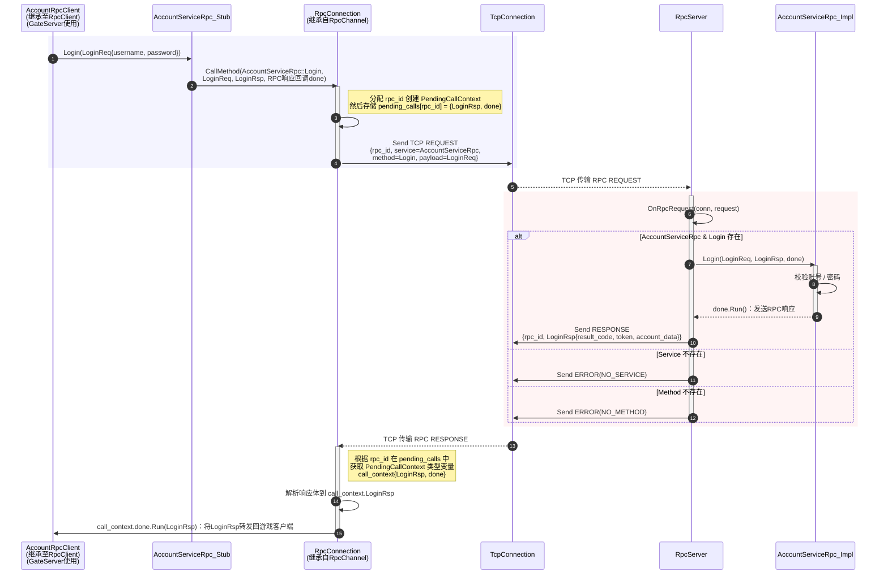

# 异步Rpc框架

## Rpc消息结构


```protobuf
message RpcMessage
{
    enum Type {
        REQUEST = 0;
        RESPONSE = 1;
        ERROR = 2; // not used
    }
    enum Status {
        NO_ERROR = 0;
        WRONG_PROTO = 1;
        NO_SERVICE = 2;
        NO_METHOD = 3;
        INVALID_REQUEST = 4;
        INVALID_RESPONSE = 5;
        TIMEOUT = 6;
    }
    Type type = 1;
    fixed64 id = 2;
    optional string service = 3;
    optional string method = 4;
    optional bytes request = 5;
    optional bytes response = 6;
    optional Status error = 7;
}
```

## Rpc框架图

#### 类图

![uml](//www.plantuml.com/plantuml/png/dLXVRzlM5N_dfxXxQffP0hQz2ORG85c30SqQE7qQ30WATPqGfKY5f3fuMm7RSMmfjIsvYTtOLcnhjMEXNIGPnlp7agilmtj9FUKhxF0UYY9DQMxpOeZtdZ_d_CwVSwu_CwsiOHNpglGxwodDKsBfivBq2M5xbqvzZgyTiigFag9Pr9Z9ofHC5UIxJxEQHbKoEHaSfzFadn8XloTtiwhwW5fFzTojJrC4kJzqLrZptxnqvlpSwjVct7VphBdhhBK_T4kiijwVcvzwUDTjdV7Z1NPnoWuMdUeIUxNABbz_w9QbRqEw7r7Z6qMcDoec0ytYvZwrxb5JDfI2fHktFXsSJT5dHMfQ3mtTqgtP0WKsu7DUD-pBDLRQOPrBj8cVblXyQyXb5dJDf66sA1UQxdDzwo4fQ1yNPu1iZvUgplOYhwsobtNdk0CGE0UNzY_VUQxAQjOqoHrPrekQvViAS0i7MNN5Ff_ZbQhzomvo0vZi-n2mpw_2s8AI40HVw4yK3GCId4tH9ue9A4QEOpY2WGFpsUKhT_adzh8nY5uvC8JlN_3L9j-yu2SRl59nUstdF-_SzdF0XRKk00um1s_TtevRNy4WGxGn_WZPj0RACe-iukF0ARkxxNIEUBddjWwH7tB9lbhYRrfkRml-yX_s-KO9f6EgZ8DGI0KS8rYWRl69aGRr_RbjjxUCbW-H6AWknu136OEJtoH6nYhofBXhPwoowH_mbUN-zoKWIGn8CgbGrTsUyBCDS-6wTFxs46r2M_uV9d_95zGO9Y8I8KnY7YD5r6DXx7sgKIDhqQ_qhwcGvMVxLgU_jIGE1Pb1SugPoMLryCgtQSexkdVdomaYVhdDNl-79kIDUrmNBFbPyvaQPNdW7GaMyIlCWZN7wqjyzvJldxFUSwWp1470g0EAigNecl0zGLHTBu3WFtz3DUiB-7qReGSoEFrABWmP7bg6VvUZCbmMDGLQIAPW6PD2C9oc1O4b5pAoge30A9KdJHodH_JA8Ed3yODqXohX9mssj08rW8UGxXW5jhCBEUQrqUu2VtyOD4sKZdRVmY9bMmrMQxEtSw2f_wR3whjkRnVA7hADDRS36i5vJp5bP1QzOVCzwyxPvsi14UX7PYAy_L83xmTzSPWYVeqlN_6DDhZ1oqTG-7WLz0Hq028MYOzbwAfA3SnF15J9Kxq8Q4996Bgcfr9vHLKLauATELEG_3shM9aPtSWOD9kR1Sh7kgwAcvciej8Sd6GjFQ_8azu51i2aLiONxSy5ICse8F_y4RK-5sBWEsmjXdFIhoglowHzamkW9POZ7a4edu0amZfCYocQrorwnvpLvCnKLilf-KcC_OIFRje3khzTuJL_JBdFhzZ1NdX00BvEvvMpS07eOu9uyNvzYW96glhS6Aq8imGl-5xLFl_froiY220i6GXoWjpJFRqnFIP0C46IoQIdi57dRtl1-i1R5T0PuEqfB5-mbKseRBlp0kOUgpLOwMSuvvTLlhbiTqxjy_Sufw1iK1gc8j3W9qe0uTCQDcfFVoAD1VdNR9worHDMQK5rmNXcxnQGQFHe0Q6YPy907dH6A4DW1UMebbNNsUe6EE6-N02ai7x2bGvb7iTkr5GBK129HWZwCSp5qHPwgHN2NbWB6z04mLzc8Oh_496aFnkY_0ClXOZ1HqoAu1yE3mbyGLVkKWrE0fj7E-8JwNf-Z2zUzBlT62o1blimZMv2Iz1yj0g1ddo37qZpCJfy9R76CQhV620LXrPqok4uyo8HwKOH4P5vuJSyE1UhIS-RCY5YhnuwXwEJp3xtLzdnjcFJ6zyliQDWaR3gAc6bzk0CHuvNls_sMNjHSFtZQr_KWwoMVK8DaF2tmH7YE45mvKGXK77G4eI7T-HdHSMWVdlrVBKxQ-nWEzxSq1feADXlSLk3RHmeqQY8FA-7GXKOYlQ4QD16WltE7xLH1vsZTZ1E8uqoWY0uH0qVA5Dyn1OBf4d_kWN5H8JC072m1936tzWs8IkZKEEOnqUJXrQm_EEW3zvmkB90GyPprbo1BP1Lr_3j43puWYcKWE6gvQwl456oo1RgXtUGHDwQa1Pl5LoJmav4K7n0JHDo16243toVXUyH7xXrZtvqzkSZDDvp-CM9SzA10DeNPMdC0oEHI4UB3unocdL00NPXjdx5rXkyjZUU-rzf4hi34VW4YhCXX_yjIMCs_9l4IX6BaNput91YAnbIH8w5Z7YP4nW3G1hl0LwiZlUXII8uSMwY9nBZNd7UDZBFQsKJFY3Aek6KGWq5swyOlzlJsWszQeJgsw0w5iJE8gkM80-2zena8xqEo3yXGt98ZV4EXHUIQMti19TYCo881Nwc2CgGhirNCfOmEYB9UCBee1jB9eM5ZVSvQ8d7-z1MeS_WReHjC8cpPrfp5a-XR-0gmbwSsLUlW1AR32vLuZy68nOlIGgQ9cRIoCeOsJ769GsoODA8Ve1CQ1p_xxpJ-4xIT8iIIoyGVMQ8ZKI6BximDIY2gpyaXvIfrBLr7Ex_c8mdMIg500qsCsYuA3ZuVq4Y7NvQWfW_9Q-bDFPcvshTwTJWdnLshov14oQU1z9dyAkOL_y7)

#### 调用示意图


- Client Stub：
  - 是Protobuf**根据`.proto`文件「自动生成的」**类
  - 其名称以`服务名_Stub`结尾，如`AccountServiceRpc_Stub`：Protobuf自动生成

- Server Stub：
  - 由服务端自行定义，**继承自**根据`.proto`文件的「自动生成」的类（其名称与服务名同名，如`AccountServiceRpc`）
  - 其名称以`服务名_Impl`结尾，如`AccountServiceRpc_Impl`：服务端自行定义（命名格式不强求，仅为项目约定）


## RPC框架核心组件

### RPC服务端：RpcServer

#### 核心职责

**`RpcServer` 是 RPC 框架中服务提供方的核心组件，主要负责：**

- **连接管理**：基于 `TcpServer` 监听并管理客户端连接
- **服务注册**：统一管理本地注册的所有服务实例及其生命周期，并通过 `ZkServiceClient` 将服务实例注册到 ZooKeeper
- **服务提供**：根据服务名和方法名，将请求分发到对应的 Protobuf Service 实现
- **同步响应**：请求处理完毕后，同步返回RPC响应，且保证请求与响应一一对应

#### RPC服务实例的要求

> 服务实例 = **继承自 `.proto` 生成类的线程安全无状态对象，实现所有 RPC 方法，执行业务逻辑，并在每次调用结束时触发响应**。

##### 1️⃣ 需要有对应的 `.proto` 文件

例如 `account_service.proto`：

```protobuf
syntax = "proto3";
package yy.protocol.app;
option cc_generic_services = true;
import "account_data.proto";

service AccountServiceRpc {
    rpc Login(LoginReq) returns(LoginRsp);
    rpc Register(RegisterReq) returns(RegisterRsp);
}

message LoginReq {
    string username = 3;
    string password = 4;
}

message LoginRsp {
    enum Status { eSuccess = 0; eAccountNotExist = 1; ePasswordError = 2; eAlreadyLoggedIn = 3; eUnknownError = 4; }
    Status result_code = 1;
    AccountBaseData account_data = 2;
    string token = 3;
}

message RegisterReq {
    string username = 3;
    string password = 4;
}

message RegisterRsp {
    enum Status { eSuccess = 0; eAccountAlreadyExist = 2; eUnknownError = 3; }
    Status result_code = 2;
    uint64 uid = 4;
}
```

> `.proto` 文件生成的 `AccountServiceRpc` 类就是服务实例的基类。

##### 2️⃣ 必须继承Protobuf生成的`Service`类

服务实现类必须继承由`.proto`中`service`生成的基类，例如：

```cpp
class AccountServiceRpc_Impl 
    : public yy::protocol::app::AccountServiceRpc
```

这是RPC框架进行**统一方法分发**的前提。

> 注意：服务实现类（`AccountServiceRpc_Impl`）必须是继承自与服务名同名的类`AccountServiceRpc`，而非客户端Stub（`AccountServiceRpc_Stub`）
>
> 注册到`RpcServer`的必须是：
>
> - ✅ `AccountServiceRpc_Impl`
> - ❌ `AccountServiceRpc_Stub`

##### 3️⃣ 继承后必须完整实现所有 `rpc` 方法

所有在`.proto`中声明的RPC方法都必须实现，且方法签名必须严格一致：

```cpp
void Login(RpcController* ctrl, const LoginReq* req, LoginRsp* rsp, Closure* done) override;
void Register(RpcController* ctrl, const RegisterReq* req, RegisterRsp* rsp, Closure* done) override;
```

##### 4️⃣ 每个RPC调用必须调用`done->Run()`

`done->Run()`负责触发响应发送：若不调用，客户端则永远收不到响应

##### 5️⃣ 服务实例必须是并发安全的

同一个服务实例可能被多个IO线程同时调用，因此：

- 服务应设计为**无状态**
- 状态应放在 Redis / MySQL / 其他服务中
- 不应保存连接或会话相关数据

### RPC客户端：RpcClient

#### 核心职责

**`RpcClient` 是 RPC 框架中客户端的核心组件，主要负责：**

- **连接管理**：维护到多个服务节点的连接池（`RpcStubConnectionPool`）
- **服务发现**：与 ZooKeeper 或自定义服务管理结合，实现服务节点列表获取
- **服务调用**：通过Protobuf Stub向**随机或指定的**远程RPC服务发送请求并接收**异步响应**
- **异步回调**：提供回调机制处理RPC响应，并自动管理响应对象生命周期

#### 自定义 RpcClient 的要求

> 自定义客户端 = **以 `.proto` 生成的 Stub 类为模板特化的客户端，封装具体 RPC 方法调用，并提供异步回调接口**。

##### 1️⃣ 需要有对应的 `.proto` 文件

使用前必须有 `.proto` 文件生成的 Stub 类，例如 `account.proto` 生成的 `AccountServiceRpc_Stub`：

```cpp
service AccountServiceRpc {
    rpc Login(LoginReq) returns(LoginRsp);
    rpc Register(RegisterReq) returns(RegisterRsp);
}
```

##### 2️⃣ 必须基于`RpcClient<Stub>`模板特化

自定义客户端必须使用框架提供的 `RpcClient` 模板，必须使用 `.proto` 文件生成的Stub类作为模板参数：

```cpp
using AccountRpcClient = core::rpc::RpcClient<yy::protocol::app::AccountServiceRpc_Stub>;
```

##### 3️⃣ 方法调用通过模板特化实现

每个 RPC 方法调用都通过模板特化 `DoCall` 调用 Stub 对应方法：

```cpp
template<>
template<>
void AccountRpcClient::DoCall<LoginReq, LoginRsp>(
    AccountServiceRpc_Stub& stub,
    RpcControllerImpl* controller,
    const LoginReq* request,
    LoginRsp* response,
    google::protobuf::Closure* done)
{
    stub.Login(controller, request, response, done);
}
```

> 这意味着新增 RPC 方法只需在对应源文件实现模板特化即可，无需修改框架核心类。

##### 4️⃣ 异步调用接口

- **随机调用服务节点**，由传入的回调函数`callback`处理响应

  ```cpp
  CallRemoteAsync_Random(request_ptr, callback);
  CallRemoteAsync_Random(request_obj, callback);
  ```

- **指定节点调用**，由传入的回调函数`callback`处理响应

  ```cpp
  CallRemoteAsync_From(server_name, request_ptr, callback);
  CallRemoteAsync_From(server_name, request_obj, callback);
  ```

> Request 对象由调用者管理，Response 对象由框架管理并在回调中返回

##### 5️⃣ 并发与线程安全

- `RpcClient` 可在多线程环境下使用
- 通过连接池管理 Stub 连接，实现多线程安全调用
- 回调保证在 IO 线程或自定义线程上下文中触发

##### 6️⃣ 生命周期管理

- 自定义客户端通常使用单例模式（`Singleton<RpcClient<Stub>>`）
- `Start()` 初始化连接池和服务节点
- 可注册连接建立回调，方便客户端监听与服务节点的连接状态

## 一次RPC调用的具体流程：以`AccountServiceRpc`为例

### 请求体和响应体格式

```protobuf
syntax = "proto3";
package yy.protocol.app;
option cc_generic_services = true;
import "account_data.proto";

message LoginReq {
    string username = 3;
    string password = 4;
}
message LoginRsp {
    enum Status {
        eSuccess = 0;
        eAccountNotExist = 1;
        ePasswordError = 2;
        eAlreadyLoggedIn = 3;
        eUnknownError = 4;
    }
    Status result_code = 1;
    AccountBaseData account_data = 2;
    string token = 3;
}

message RegisterReq {
    string username = 3;
    string password = 4;
}
message RegisterRsp {
    enum Status {
        eSuccess = 0;
        eAccountAlreadyExist = 2;
        eUnknownError = 3;
    }
    Status result_code = 2;
    uint64 uid = 4;
}

service AccountServiceRpc
{
    rpc Login(LoginReq) returns(LoginRsp);
    rpc Register(RegisterReq) returns(RegisterRsp);
}
```

### RPC调用流程：以`Login`为例




