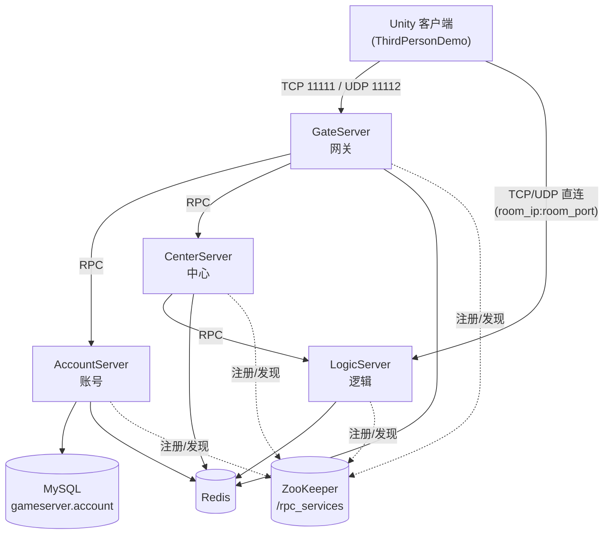
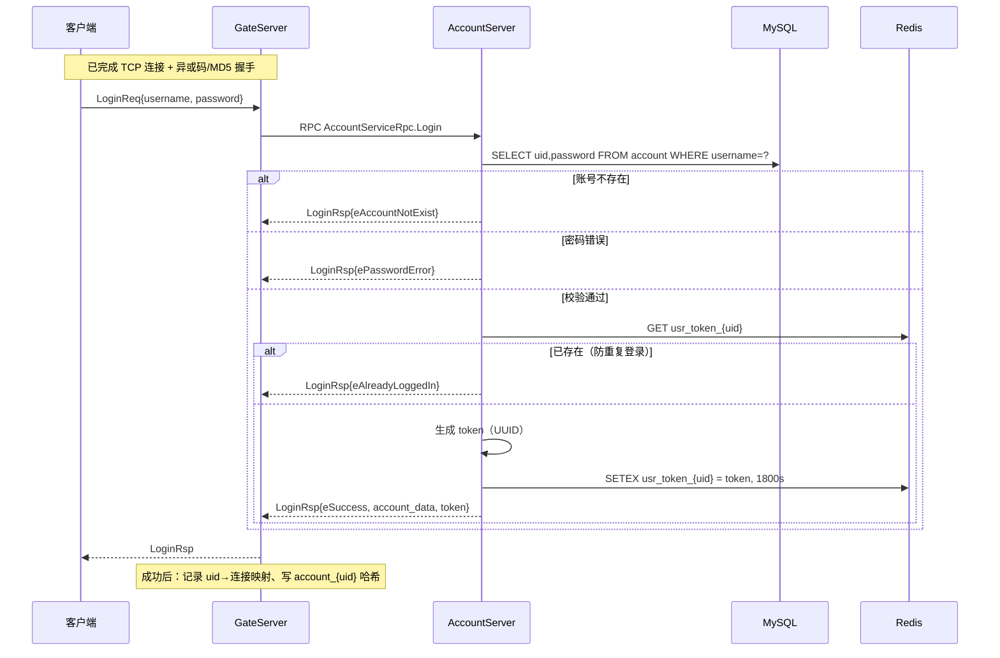
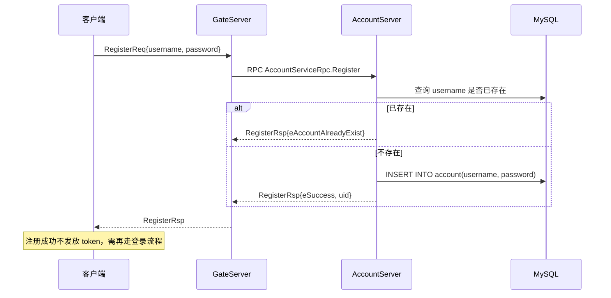
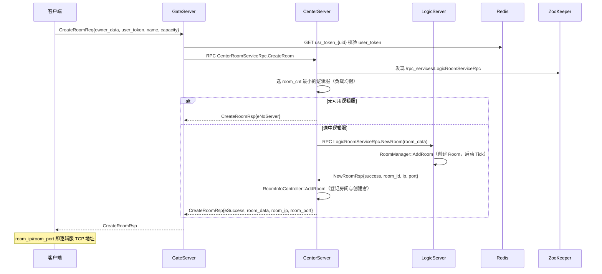
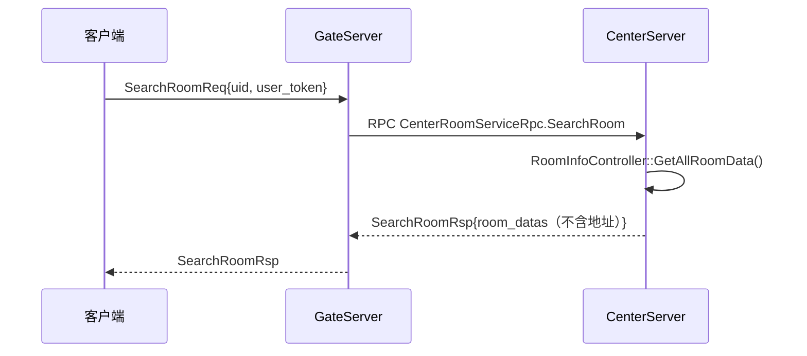
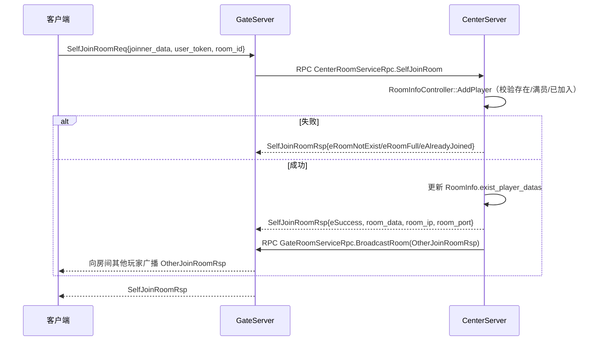
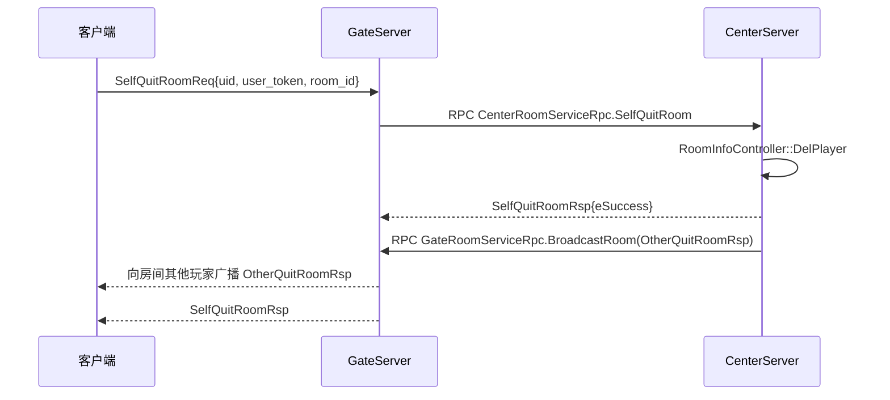
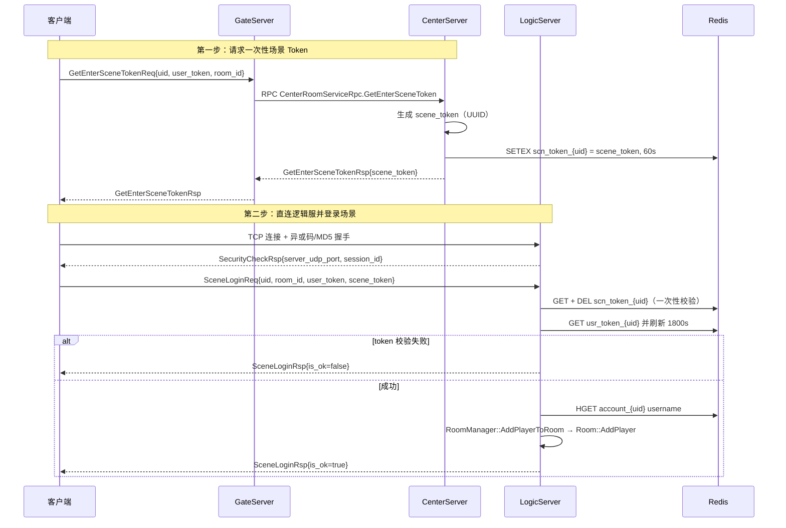
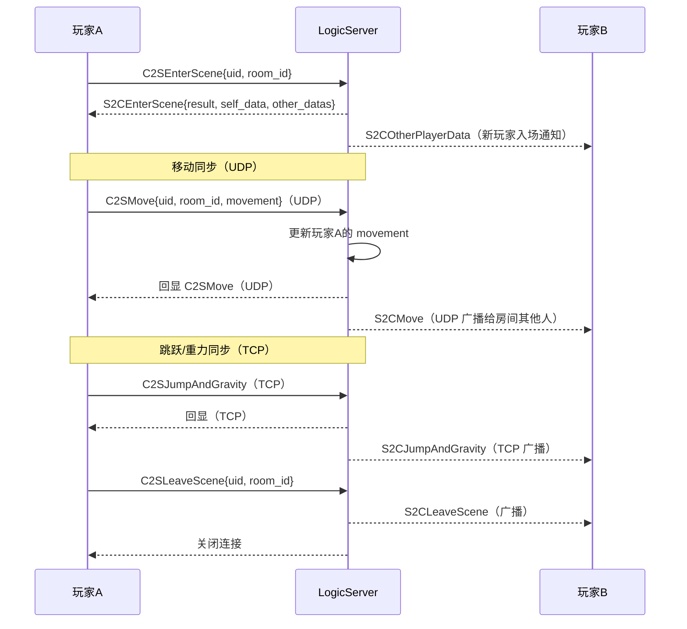
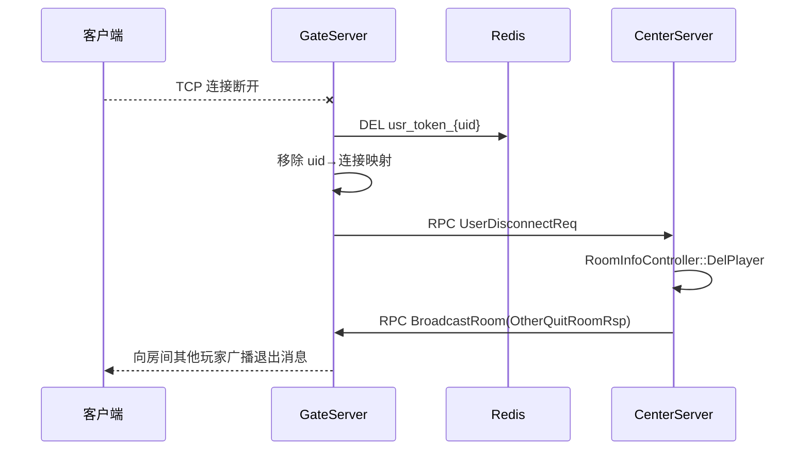

# 核心业务流程与时序

> 本文档用 Mermaid 时序图描述 GameServer 四个服务的**核心业务流程**：
> 登录/注册、建房、进房/退房、场景登录与同步、掉线处理。
> 协议细节（消息格式、命令枚举、消息体定义）见 [`protocol.md`](./protocol.md)。

## 一、服务拓扑

| 服务 | TCP 前端 | UDP 前端 | RPC 端口 | ZooKeeper 服务名 |
|------|---------|---------|---------|-----------------|
| GateServer | 11111 | 11112 | 11113 | `GateRoomServiceRpc` |
| AccountServer | — | — | 12223 | `AccountServiceRpc` |
| CenterServer | — | — | 14443 | `CenterRoomServiceRpc` |
| LogicServer | 随机 | 随机 | 随机 | `LogicRoomServiceRpc` |

> LogicServer 的 TCP/UDP/RPC 端口均为**随机分配**（代码绑定 `0.0.0.0`，不读配置），
> 客户端通过建房/进房响应中的 `room_ip`/`room_port` 得知其地址。

## 二、Redis Key 速查

| Key | 类型 | TTL | 说明 |
|-----|------|-----|------|
| `usr_token_{uid}` | string | 1800s（每次校验刷新） | 登录 token，防重复登录 |
| `scn_token_{uid}` | string | 60s（**一次性**，GET 后 DEL） | 场景登录 token |
| `account_{uid}` | hash（`username`） | 无 | 账号缓存（Gate 登录成功时写入） |

- Token 生成：`stduuid` 的 UUID 随机生成器（`util::GenerateToken`）。
- 房间 ID：UUID 经 `std::hash` 转为 `uint64_t`。

## 三、登录流程

## 四、注册流程

## 五、建房流程（CreateRoom）

## 六、查房 / 进房 / 退房

### 6.1 查询房间列表（SearchRoom）

### 6.2 加入房间（SelfJoinRoom）

### 6.3 退出房间（SelfQuitRoom）

> 注意：进房/退房只更新 **CenterServer** 的房间信息，逻辑服侧要等场景登录才真正 `AddPlayer`。

## 七、场景登录（客户端直连逻辑服）

## 八、进入场景与状态同步

> ⚠️ 通道不对称：**移动走 UDP、跳跃走 TCP**；主动离开广播走 TCP，断线广播走 UDP。

## 九、掉线处理

## 十、实现备注与未完成点

| 事项 | 说明 |
|------|------|
| 防重复登录策略 | 登录时若 `usr_token_{uid}` 已存在则**拒绝新登录**（非踢掉旧登录） |
| `Room::Update()` | 当前为空函数，房间 Tick 暂无业务逻辑 |
| `GetEnterSceneToken` | 未校验玩家是否真的在房间内，恒返回 `eSuccess` |
| `SearchRoom` 过滤 | proto 中有 `//todo 过滤条件`，未实现 |
| 端口 | LogicServer 三端口随机分配，配置 `rpcPort` 对逻辑服未生效 |
| 账号哈希写入 | `account_{uid}` 由 **Gate 在登录成功时**写入（Account 的 DAO 是死代码） |
