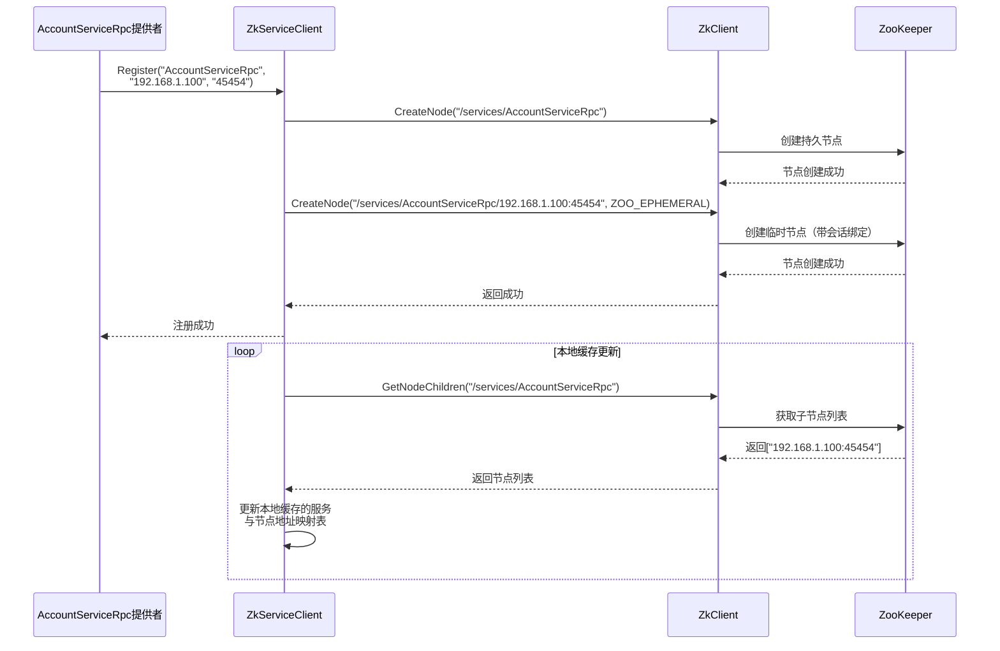
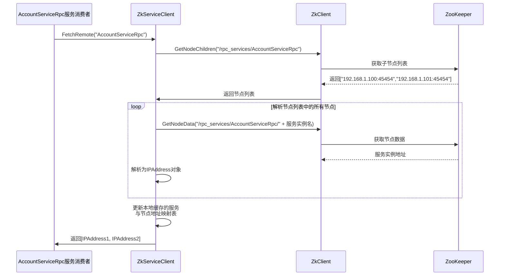
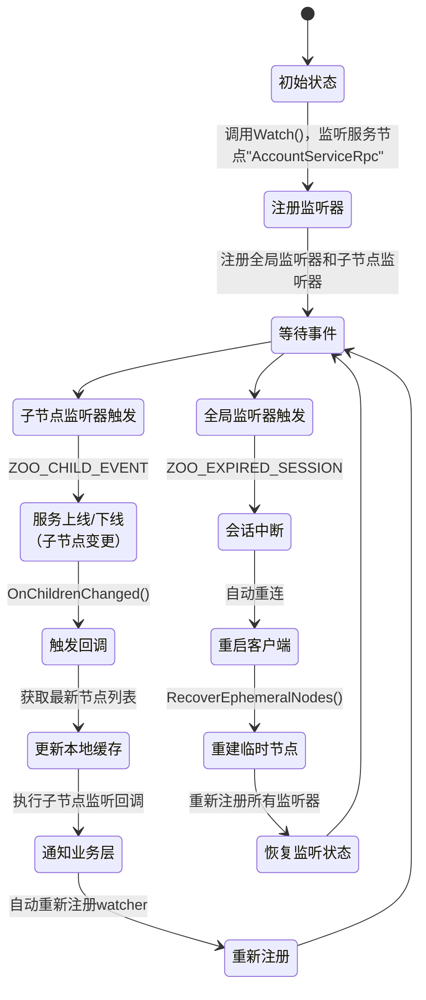

# ZooKeeper服务注册与发现系统

## 文件组织结构

- **`ZkClient.h`**：封装ZooKeeper C API的基础客户端，提供：
  - **节点操作**：持久/临时节点创建、数据获取、子节点遍历。
  - **监听机制**：子节点变更事件注册。
  - **连接管理**：会话断线重建时自动恢复临时节点。
- **`ZkServiceClient.h`**：面向微服务的抽象层，实现：
  - **服务注册**：以`IP:Port`为实例名创建临时节点（服务名→实例名的树状结构）。
  - **服务发现**：支持远程强一致获取和本地缓存。
  - **服务监听**：基于`ZkClient`监听能力封装服务级变更回调。

## 服务注册时序图

## 服务发现时序图

## 服务监听机制

