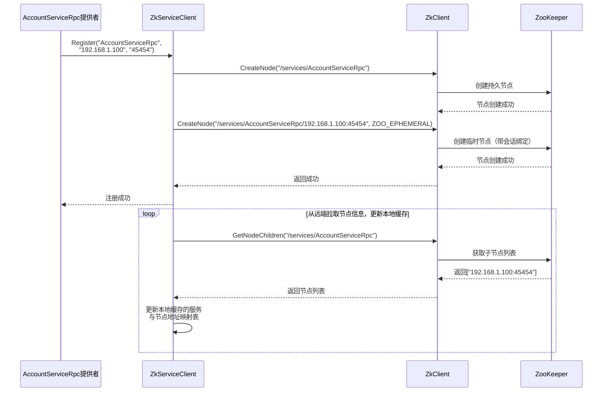
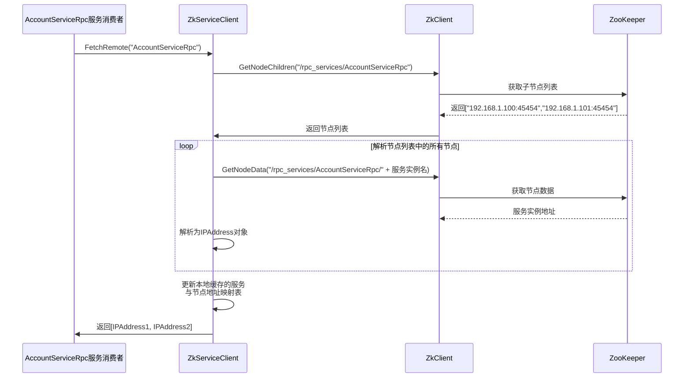
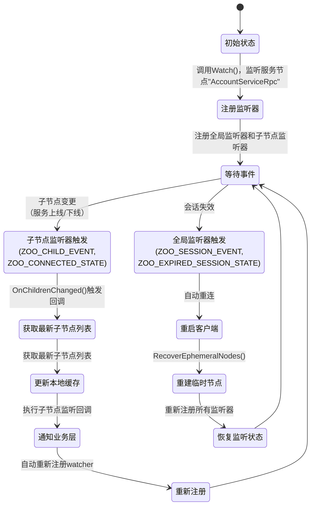

# ZooKeeper服务治理客户端

> 该ZooKeeper服务治理客户端模块**为RPC框架提供服务注册、服务发现与服务变更感知能力，是RPC客户端进行连接管理和负载均衡的基础支撑组件。**

## 类组织结构

- **`ZkClient`**：封装 ZooKeeper C API 的基础客户端，提供：
  - **节点操作**：持久 / 临时节点创建、数据获取、子节点遍历。
  - **监听机制**：子节点变更事件注册。
  - **连接管理**：会话断线重连后自动恢复已注册的临时节点。

- **`ZkServiceClient`**：面向服务治理的高层客户端抽象，基于 `ZkClient` 实现：
  - **服务注册**：以 `IP:Port` 为实例标识创建临时节点，构建 *服务名 → 实例节点* 的树状结构。
  - **服务发现**：支持从 ZooKeeper 拉取服务实例列表，并维护本地缓存以提升访问效率。
  - **服务监听**：封装服务级节点变更监听机制，在服务实例增删时自动更新本地缓存并触发回调。

## 服务注册时序图

## 服务发现时序图

## 服务监听机制

