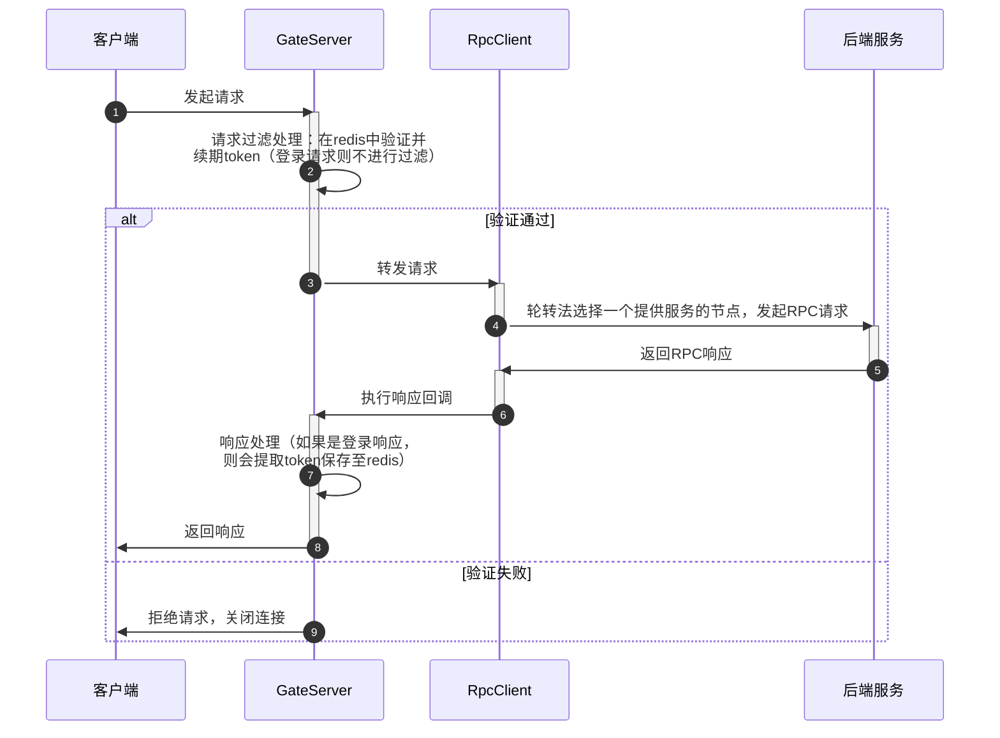
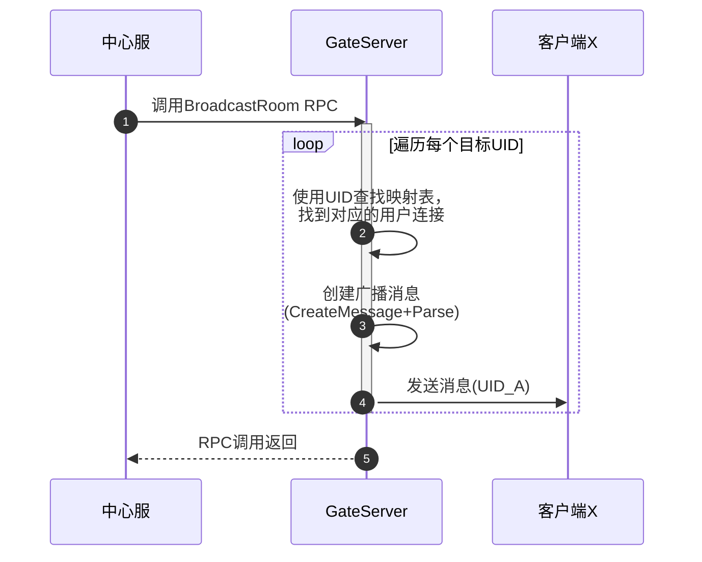
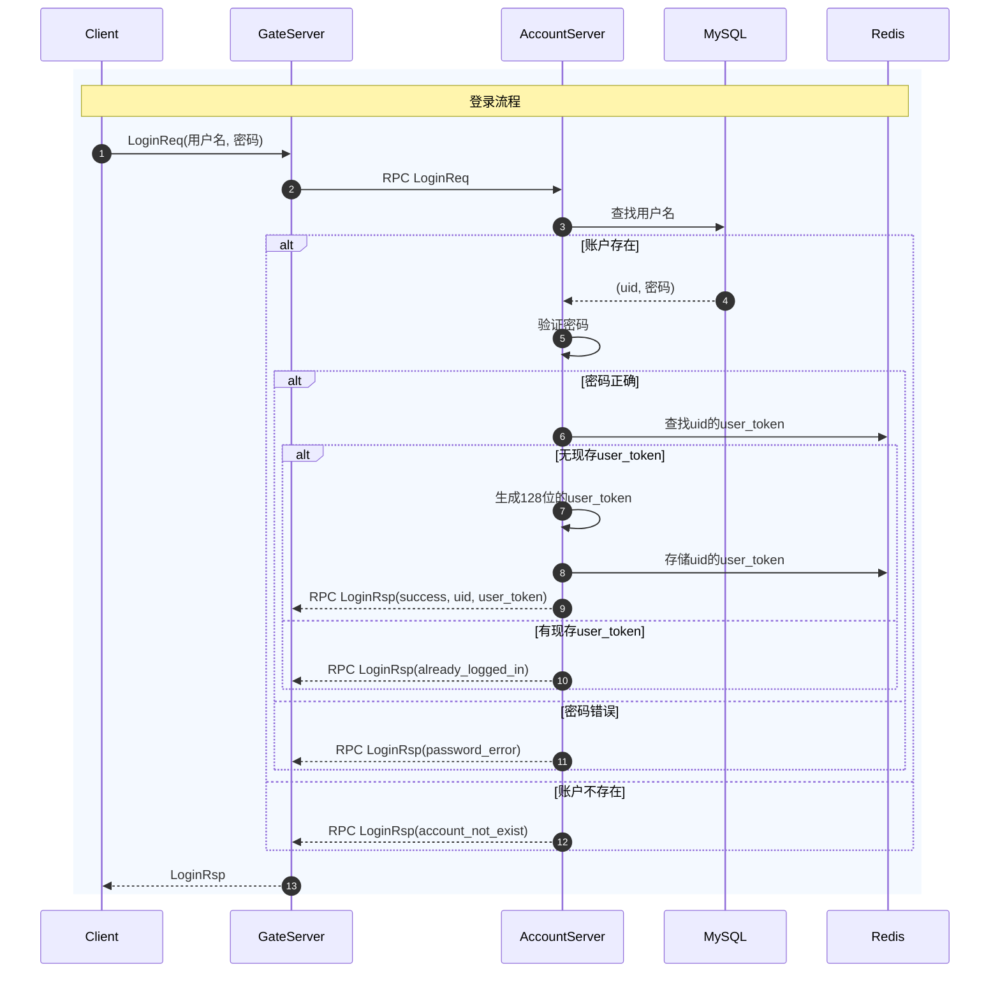
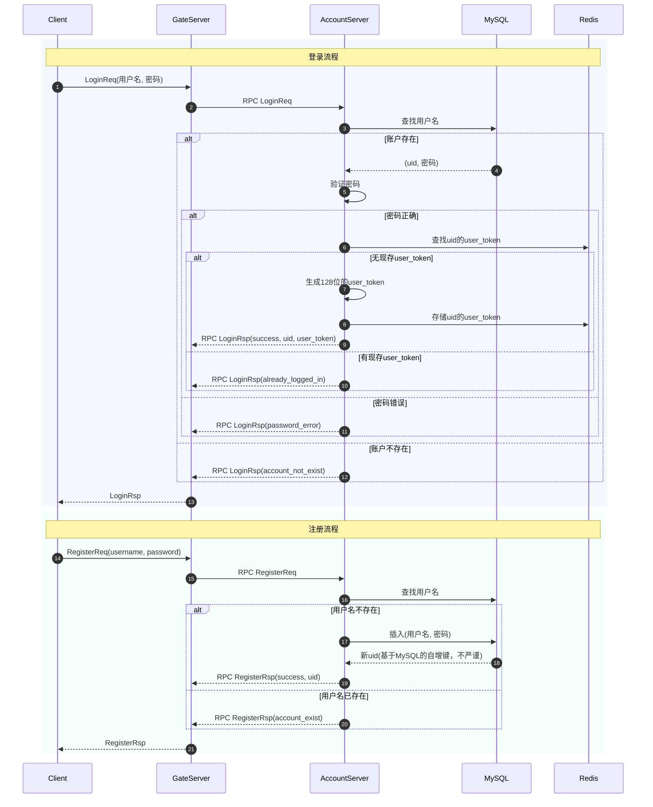
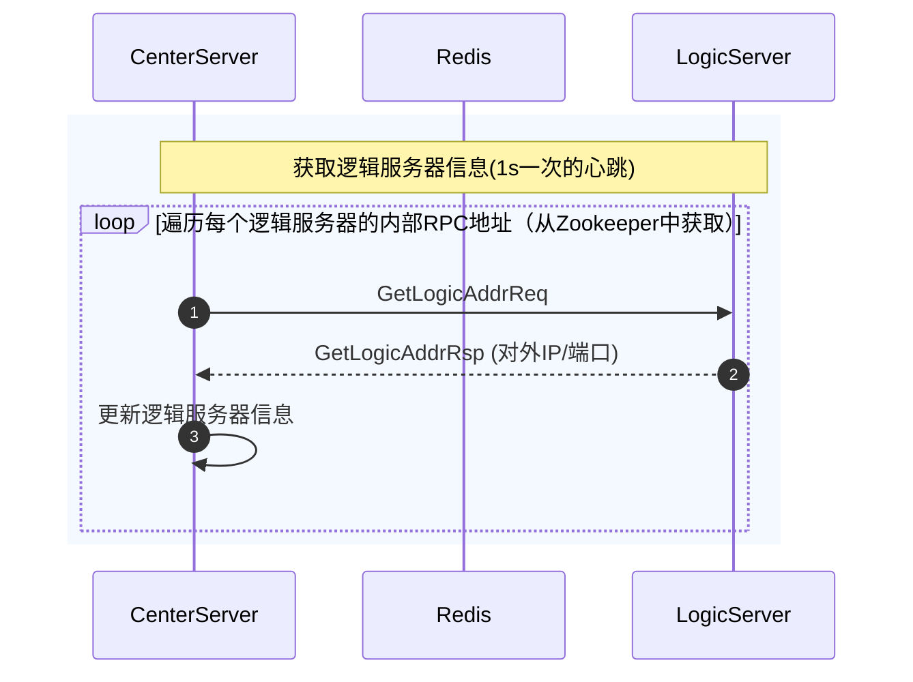
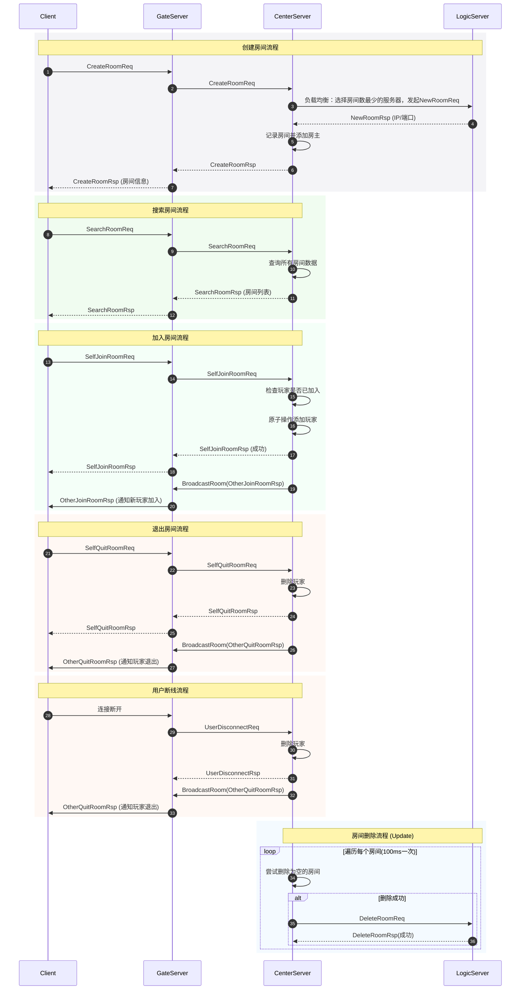
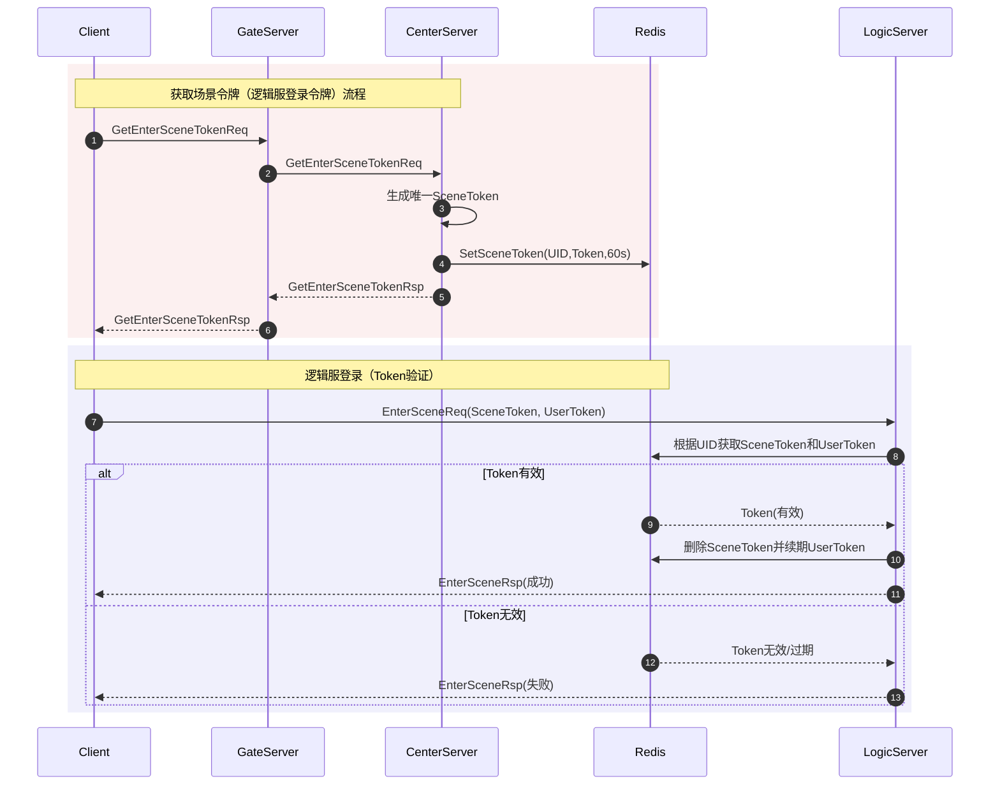
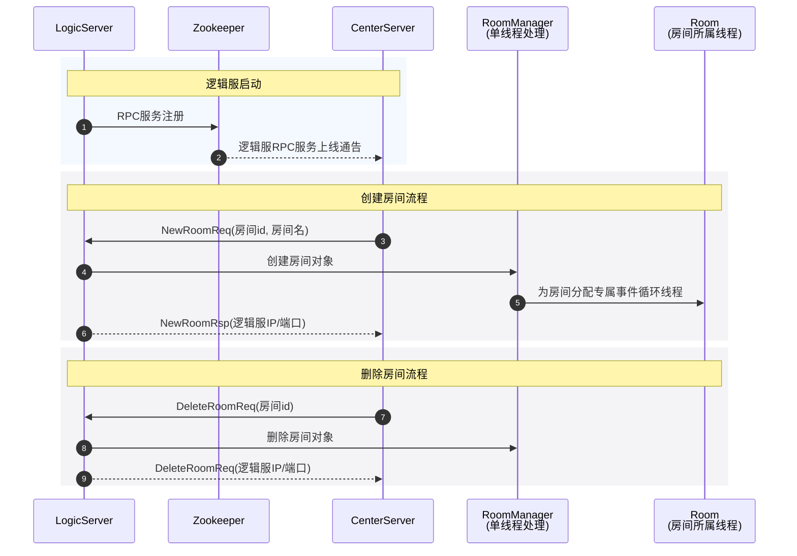
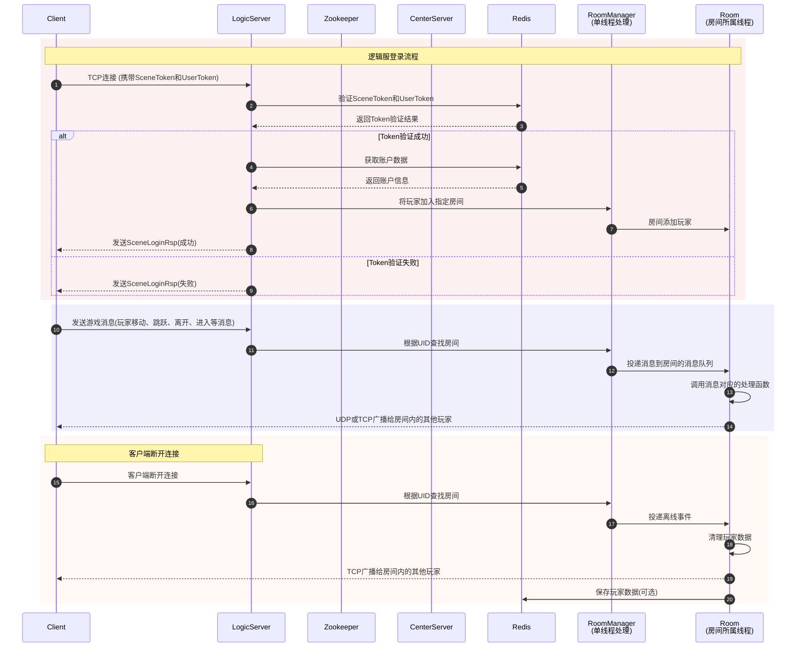

## 网关服（GateServer）的时序图

### 带token过滤机制的异步消息转发功能

### 用户广播功能

## 账号服（AccountServer）的时序图

### 登录时序图

### 注册时序图

## 中心服（CenterServer）房间管理的时序图

### 逻辑服信息管理时序图

### 中心服房间管理时序图

### 逻辑服登录时序图

Redis在这个架构中作为“令牌中心”保存中心服生成的逻辑服登录令牌，供由逻辑服验证客户端。

## 逻辑服消息时序图

### 逻辑服房间管理时序图

### 逻辑服连接管理与玩家同步时序图

